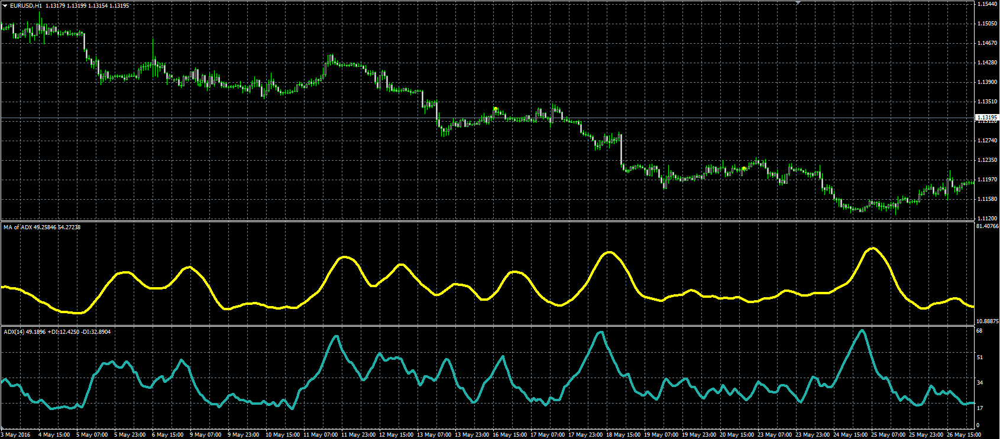

# MA of ADX oscillator

> Source: https://fxcodebase.com/code/viewtopic.php?f=38&t=63576  
> Forum: 38 · Topic 63576 · 1 post(s)

---

## MA of ADX oscillator

**Alexander.Gettinger** · Thu Jun 09, 2016 4:30 pm

Formula:
ADX_MA=MA(ADX) with [MA_Length] number of periods and [MA_Method] type,
ADX - Average Directional Movement Index with [ADX_Length] number of periods for [Price].

 

Download:

 [ADX_MA.mq4](files/106694/ADX_MA.mq4)
