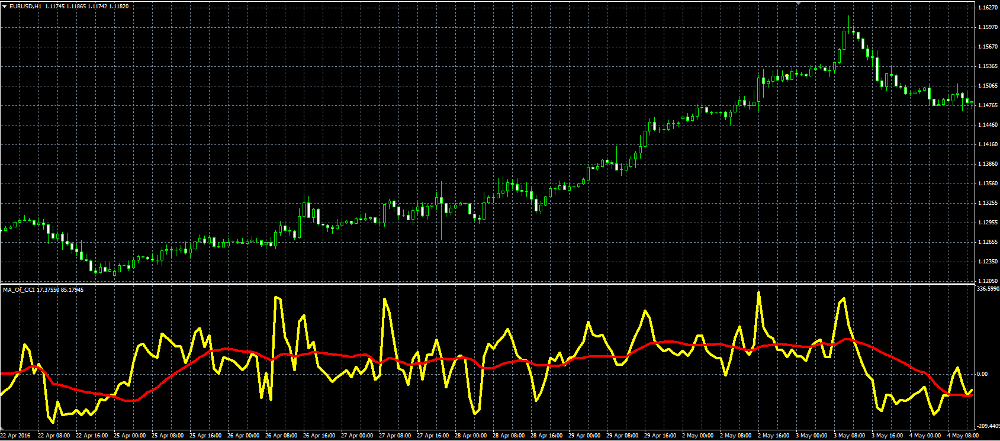

# MA of CCI oscillator

> Source: https://fxcodebase.com/code/viewtopic.php?f=38&t=63572  
> Forum: 38 · Topic 63572 · 1 post(s)

---

## MA of CCI oscillator

**Alexander.Gettinger** · Thu Jun 09, 2016 4:24 pm

Formula:
MA of CCI=MA(CCI) with [MA_Length] number of periods and [MA_Method] type,
CCI - Commodity Channel Index with [CCI_Length] number of periods for [Price].

 

Download:

 [MA_Of_CCI.mq4](files/106690/MA_Of_CCI.mq4)
