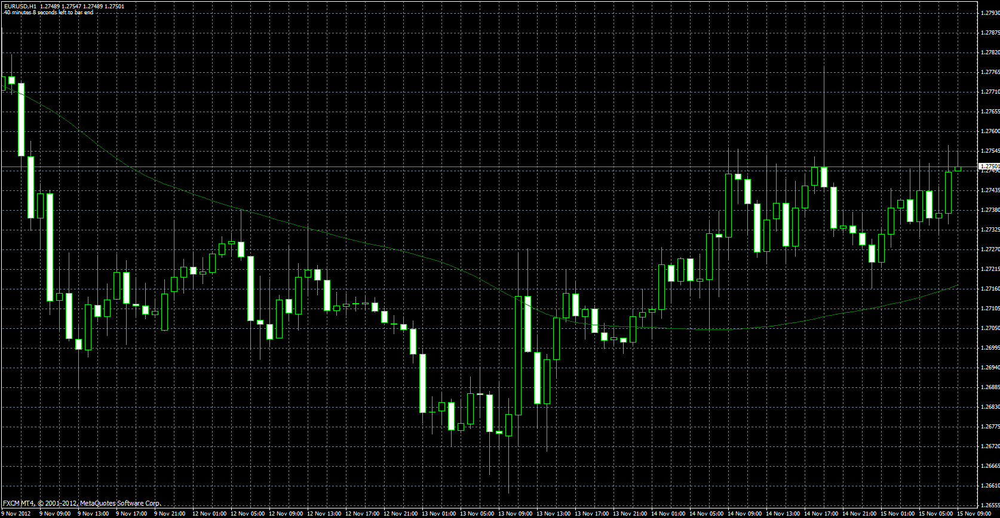

# MA of MA

> Source: https://fxcodebase.com/code/viewtopic.php?f=38&t=26029  
> Forum: 38 · Topic 26029 · 4 post(s)

---

## MA of MA

**Apprentice** · Thu Nov 15, 2012 4:19 am

This indicator will calculate the MA of MA of Price.

 [MAofMA.mq4](files/44645/MAofMA.mq4)

---

## Re: MA of MA

**philname** · Sat Nov 17, 2012 12:13 am

Great work thanks, i searched the MA of MA is very helpful to give a "signal" like the main/signal mode like the stochastic !

Can you make the same with the T3 MA, so the indicator shows just the MA of T3 MA ?

Code: [Select all](https://fxcodebase.com/code/)
`[list]//+------------------------------------------------------------------+
//|                                                     T3 clean.mq4 |
//|                                                           mladen |
//+------------------------------------------------------------------+
#property copyright "mladen"
#property link      "[[email protected]](https://fxcodebase.com/cdn-cgi/l/email-protection)"

#property indicator_chart_window
#property indicator_buffers 1
#property indicator_color1 Blue
#property indicator_width1 2

//
//
//
//
//

extern int    T3Period  = 14;
extern int    T3Price   = PRICE_CLOSE;
extern double b         = 0.618;
extern string TimeFrame = "current time frame";

//
//
//
//
//

double t3Array[];
double ae1[];
double ae2[];
double ae3[];
double ae4[];
double ae5[];
double ae6[];

//
//
//
//
//

int    timeFrame;
string IndicatorFileName;

//+------------------------------------------------------------------+
//|                                                                  |
//+------------------------------------------------------------------+

int init()
{
   IndicatorBuffers(7);
   SetIndexBuffer(0,t3Array);
   SetIndexBuffer(1,ae1);
   SetIndexBuffer(2,ae2);
   SetIndexBuffer(3,ae3);
   SetIndexBuffer(4,ae4);
   SetIndexBuffer(5,ae5);
   SetIndexBuffer(6,ae6);

   //
   //
   //
   //
   //
   //

   timeFrame = stringToTimeFrame(TimeFrame);
   IndicatorShortName("T3 Moving Average "+TimeFrameToString(timeFrame)+"("+T3Period+")");
   IndicatorFileName = WindowExpertName();
   return(0);
}

//+------------------------------------------------------------------+
//|                                                                  |
//+------------------------------------------------------------------+

int start()
{
   int counted_bars=IndicatorCounted();
   int i,limit;

   if(counted_bars<0) return(-1);
   if(counted_bars>0) counted_bars--;
      limit=Bars-counted_bars;

   //
   //
   //
   //
   //
   
   if (timeFrame != Period())
   {
      datetime TimeArray[];
         limit = MathMax(limit,timeFrame/Period());
         ArrayCopySeries(TimeArray ,MODE_TIME ,NULL,timeFrame);
         
         //
         //
         //
         //
         //
         
         for(i=0,int y=0; i<limit; i++)
         {
            if(Time[i]<TimeArray[y]) y++;
               t3Array[i] = iCustom(NULL,timeFrame,IndicatorFileName,T3Period,T3Price,b,0,y);
         }
      return(0);         
   }
         
   //
   //
   //
   //
   //

   CalculateT3(limit,T3Period,T3Price);   
   return(0);
}

//+------------------------------------------------------------------+
//|                                                                  |
//+------------------------------------------------------------------+
//
//
//
//
//

int    t3.period;
double e1,e2,e3,e4,e5,e6;
double c1,c2,c3,c4;
double w1,w2,b2,b3;

//
//
//
//
//

double CalculateT3(int limit,int period,int priceType)
{
   if (t3.period != period)
   {
      t3.period = period;
         b2 = b*b;
         b3 = b2*b;

         c1 = -b3;
         c2 = (3*(b2+b3));
         c3 = -3*(2*b2+b+b3);
         c4 = (1+3*b+b3+3*b2);

         w1 = 2 / (2 + 0.5*(MathMax(1,period)-1));
         w2 = 1 - w1;
   }
   
   //
   //
   //
   //
   //
   
   for(int i=limit; i>=0; i--)
   {
      double price = iMA(NULL,0,1,0,MODE_SMA,priceType,i);
      e1 = w1*price + w2*ae1[i+1];
      e2 = w1*e1    + w2*ae2[i+1];
      e3 = w1*e2    + w2*ae3[i+1];
      e4 = w1*e3    + w2*ae4[i+1];
      e5 = w1*e4    + w2*ae5[i+1];
      e6 = w1*e5    + w2*ae6[i+1];
         t3Array[i]=c1*e6 + c2*e5 + c3*e4 + c4*e3;
         ae1[i] = e1;
         ae2[i] = e2;
         ae3[i] = e3;
         ae4[i] = e4;
         ae5[i] = e5;
         ae6[i] = e6;
   }   
}

//+------------------------------------------------------------------+
//|
//+------------------------------------------------------------------+
//
//
//
//
//

int stringToTimeFrame(string tfs)
{
   int tf=0;
       tfs = StringTrimLeft(StringTrimRight(StringUpperCase(tfs)));
         if (tfs=="M1" || tfs=="1")     tf=PERIOD_M1;
         if (tfs=="M5" || tfs=="5")     tf=PERIOD_M5;
         if (tfs=="M15"|| tfs=="15")    tf=PERIOD_M15;
         if (tfs=="M30"|| tfs=="30")    tf=PERIOD_M30;
         if (tfs=="H1" || tfs=="60")    tf=PERIOD_H1;
         if (tfs=="H4" || tfs=="240")   tf=PERIOD_H4;
         if (tfs=="D1" || tfs=="1440")  tf=PERIOD_D1;
         if (tfs=="W1" || tfs=="10080") tf=PERIOD_W1;
         if (tfs=="MN" || tfs=="43200") tf=PERIOD_MN1;
         if (tf<Period()) tf=Period();
  return(tf);
}
string TimeFrameToString(int tf)
{
   string tfs="";
   
   if (tf!=Period())
      switch(tf) {
         case PERIOD_M1:  tfs="M1"  ; break;
         case PERIOD_M5:  tfs="M5"  ; break;
         case PERIOD_M15: tfs="M15" ; break;
         case PERIOD_M30: tfs="M30" ; break;
         case PERIOD_H1:  tfs="H1"  ; break;
         case PERIOD_H4:  tfs="H4"  ; break;
         case PERIOD_D1:  tfs="D1"  ; break;
         case PERIOD_W1:  tfs="W1"  ; break;
         case PERIOD_MN1: tfs="MN1";
      }
   return(tfs);
}

//
//
//
//
//

string StringUpperCase(string str)
{
   string   s = str;
   int      lenght = StringLen(str) - 1;
   int      char;
   
   while(lenght >= 0)
      {
         char = StringGetChar(s, lenght);
         
         //
         //
         //
         //
         //
         
         if((char > 96 && char < 123) || (char > 223 && char < 256))
                  s = StringSetChar(s, lenght, char - 32);
         else
              if(char > -33 && char < 0)
                  s = StringSetChar(s, lenght, char + 224);
         lenght--;
   }
   
   //
   //
   //
   //
   //
   
   return(s);
}[/list]`

---

## Re: MA of MA

**Apprentice** · Sat Nov 17, 2012 4:14 am

Your request is added to the development list.

---

## Re: MA of MA

**Apprentice** · Tue Dec 11, 2012 11:11 am

Updated.
