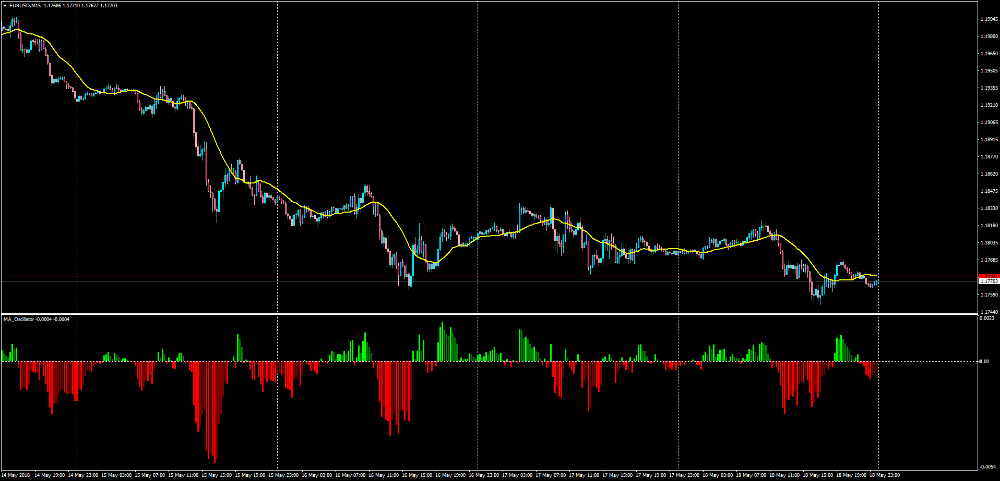

# MA Oscillator

> Source: https://fxcodebase.com/code/viewtopic.php?f=38&t=66136  
> Forum: 38 · Topic 66136 · 1 post(s)

---

## MA Oscillator

**Apprentice** · Mon May 21, 2018 5:08 am

LUA Original: [viewtopic.php?f=17&t=6488](https://fxcodebase.com/code/viewtopic.php?f=17&t=6488)

Description:

This is the MT4 version of the LUA original indicator MA Oscillator which is a subwindow representation of any of 17 different moving averages as an oscillator, following this formula:

MA_Oscillator=Price/MA-1

 [MA_Oscillator.mq4](files/119322/MA_Oscillator.mq4)
