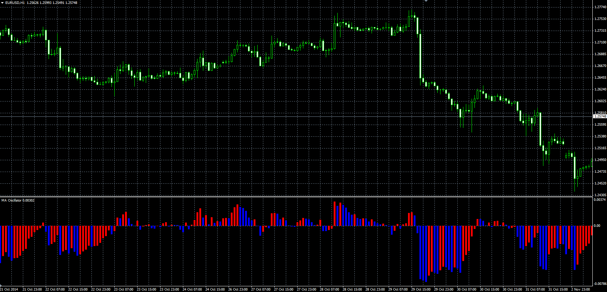

# MA oscillator

> Source: https://fxcodebase.com/code/viewtopic.php?f=38&t=61504  
> Forum: 38 · Topic 61504 · 1 post(s)

---

## MA oscillator

**Alexander.Gettinger** · Thu Nov 20, 2014 6:01 pm

MA as an oscillator.

Formula:
MA_Oscillator = Price/MA-1, where
MA - moving average with [Length] number of periods and [Method] type.

 

Download:

 [MA_Oscillator.mq4](files/97243/MA_Oscillator.mq4)
