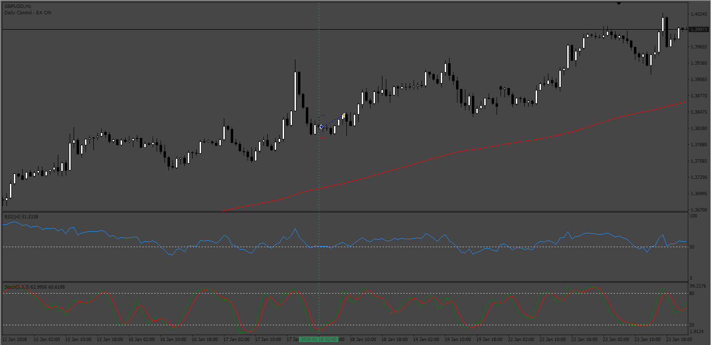
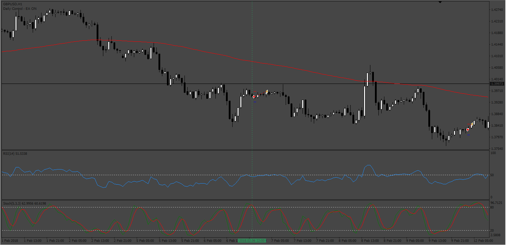

# MA_RSI_Stoch EA

> Source: https://fxcodebase.com/code/viewtopic.php?f=38&t=73427  
> Forum: 38 · Topic 73427 · 8 post(s)

---

## MA_RSI_Stoch EA

**Apprentice** · Tue Feb 28, 2023 5:48 am

 

Based on the request.
[https://fxcodebase.com/code/viewtopic.php?f=27&p=149685](https://fxcodebase.com/code/viewtopic.php?f=27&p=149685)

 [MA_RSI_Stoch.mq4](files/149803/MA_RSI_Stoch.mq4)

 [MA_RSI_STOCH_EA_v1.00.mq5](files/149803/MA_RSI_STOCH_EA_v1.00.mq5)

TS2 version
[https://fxcodebase.com/code/viewtopic.php?f=31&t=73830](https://fxcodebase.com/code/viewtopic.php?f=31&t=73830)

---

## Re: MA_RSI_Stoch EA

**Elielson00x** · Tue Feb 28, 2023 6:15 am

Thank you very much for your work Sir, Apprentice, I will be waiting for the MT5 version, thank you!

---

## Re: MA_RSI_Stoch EA

**YOUYOUMA** · Sat Jun 10, 2023 4:15 pm

Bonjour
est cce possible d'avoir cet EA en lua ? merci

---

## Re: MA_RSI_Stoch EA

**Apprentice** · Thu Jun 15, 2023 5:31 am

We have added your request to the development list.
Development reference 529.

---

## Re: MA_RSI_Stoch EA

**Apprentice** · Thu Jun 15, 2023 7:32 am

TS2 version
[https://fxcodebase.com/code/viewtopic.php?f=31&t=73830](https://fxcodebase.com/code/viewtopic.php?f=31&t=73830)

---

## Re: MA_RSI_Stoch EA

**rickCreations** · Sun Oct 15, 2023 3:10 am

mq5 version:

Testing EURUSD H1 (Default settings)

**2023.10.15 16:07:50.557	2023.07.06 05:45:00 zero divide, check divider to avoid this error in 'MA_RSI_STOCH_EA_v1.00.mq5' (858,30)**

Code: [Select all](https://fxcodebase.com/code/)
`double maxlotMargin = (eq / marginReq) * 0.95;`

---

## Re: MA_RSI_Stoch EA

**Apprentice** · Tue Oct 17, 2023 10:27 am

We have added your request to the development list.
Development reference 930

---

## Re: MA_RSI_Stoch EA

**Apprentice** · Tue Nov 28, 2023 7:24 am

[MA_RSI_STOCH_EA_v1.10.mq5](files/153434/MA_RSI_STOCH_EA_v1.10.mq5)

Try this version.
