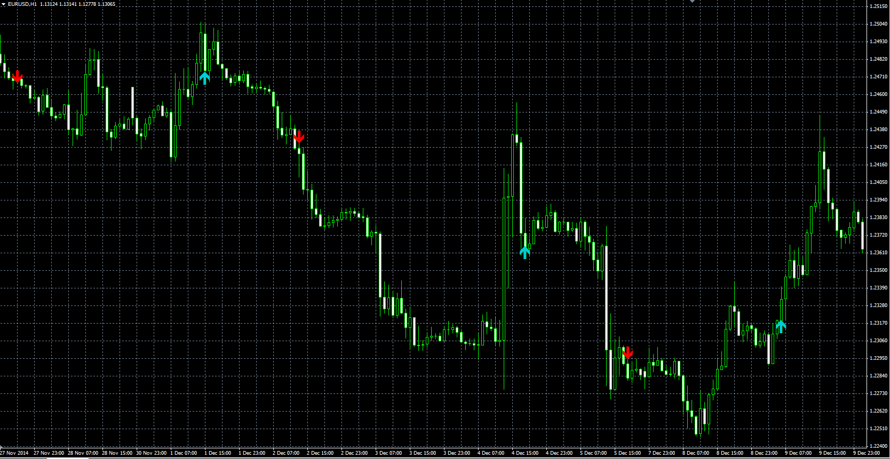

# MA signal indicator

> Source: https://fxcodebase.com/code/viewtopic.php?f=38&t=61857  
> Forum: 38 · Topic 61857 · 1 post(s)

---

## MA signal indicator

**Alexander.Gettinger** · Mon Feb 23, 2015 11:08 am

**Up Arrow:**
MA1 > MA2 and MA3 > MA4.

**Down Arrow:**
MA1 < MA2 and MA3 < MA4.

MA1 - moving average with [Length1] number of periods and [Method1] type from [Price1], etc.

 

Download:

 [MA_Signal.mq4](files/98805/MA_Signal.mq4)
