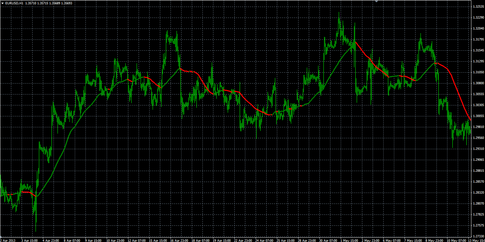

# MA Slope indicator

> Source: https://fxcodebase.com/code/viewtopic.php?f=38&t=60021  
> Forum: 38 · Topic 60021 · 6 post(s)

---

## MA Slope indicator

**Alexander.Gettinger** · Fri Nov 29, 2013 2:13 pm

Original LUA indicator: [viewtopic.php?t=1122&f=17#p2143](https://fxcodebase.com/code/viewtopic.php?t=1122&f=17#p2143).

 

Download:

 [MA_Slope.mq4](files/91232/MA_Slope.mq4)

Version with alert
[https://fxcodebase.com/code/viewtopic.php?f=38&t=73298](https://fxcodebase.com/code/viewtopic.php?f=38&t=73298)

---

## Re: MA Slope indicator

**Alexander.Gettinger** · Mon Dec 02, 2013 10:56 am

MA Slope oscillator: [viewtopic.php?f=38&t=60048](https://fxcodebase.com/code/viewtopic.php?f=38&t=60048).

---

## Re: MA Slope indicator

**nweiss** · Wed Jun 11, 2014 5:21 pm

Could you add pls an Alert Pop Up and an Email Alert when it is Possible ?

Thx Nikita

---

## Re: MA Slope indicator

**Apprentice** · Fri Jun 13, 2014 3:15 am

Your request is added to the development list.

---

## Re: MA Slope indicator

**Taskryr** · Wed Feb 22, 2017 3:19 pm

Hello,

I am transitioning from Marketscope to Metatrader and seem to be having some issue with this indicator. As far as I can tell I have everything setup the same for this indicator, but I am getting slightly different signals now on Metatrader. I have attached an image from each platform. Both indicators are set for 8 periods, 0 slope, and 1 bar. Marketscope is set to close, haven't figured out how to check that on Metatrader. Also, I did notice that metatrader is showing weekends as separate days, but that doesn't seem to be enough to account for the difference in signals.

Any suggestions you might have would be helpful.

---

## Re: MA Slope indicator

**Apprentice** · Tue Feb 28, 2017 4:27 am

From what I can see,
market date, candles are also different.
