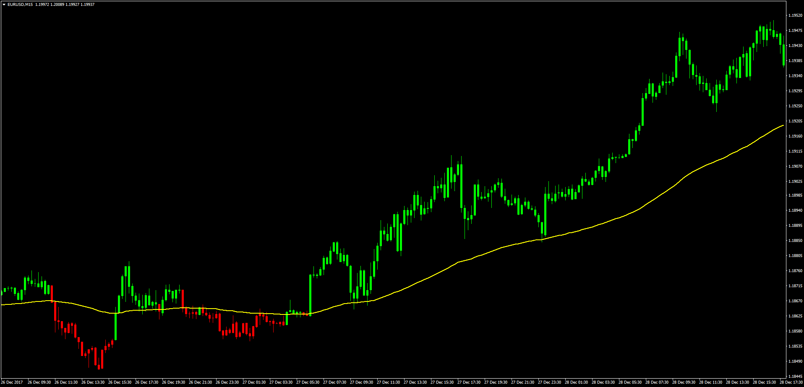

# MA Slope MA Price Overlay with Alert

> Source: https://fxcodebase.com/code/viewtopic.php?f=38&t=65494  
> Forum: 38 · Topic 65494 · 1 post(s)

---

## MA Slope MA Price Overlay with Alert

**Apprentice** · Sun Dec 31, 2017 5:43 am

LUA Original: [viewtopic.php?f=17&t=16163](https://fxcodebase.com/code/viewtopic.php?f=17&t=16163)

Description:

Another interesting LUA study that has been ported to MT4. Here we are interested to observe the color of the candles according to the position of price in regards of a moving average, or the color of the candles according to the moving average slope. It comes with an alert feature that lets the trader be awared when the change of color comes, particularly handy after long trends.

 [MA_Slope_MA_Price_Overlay.mq4](files/116685/MA_Slope_MA_Price_Overlay.mq4)
