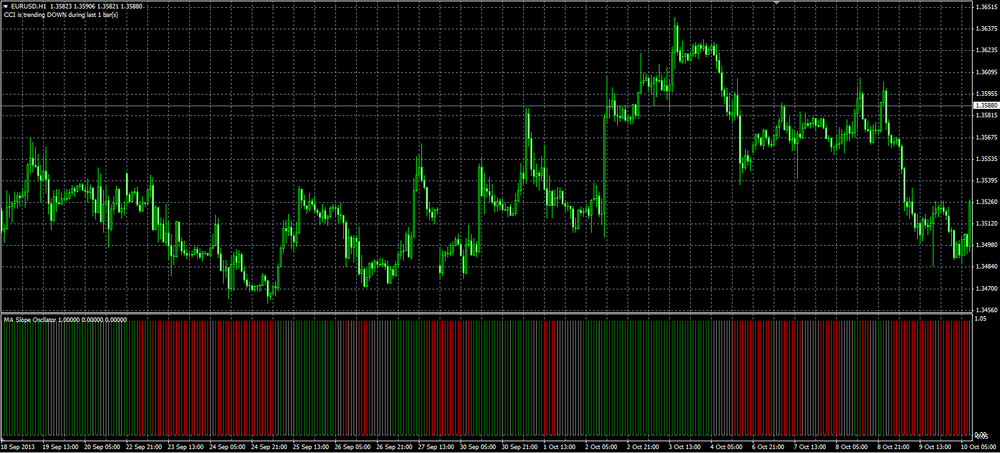

# MA Slope Oscilator

> Source: https://fxcodebase.com/code/viewtopic.php?f=38&t=60048  
> Forum: 38 · Topic 60048 · 4 post(s)

---

## MA Slope Oscilator

**Alexander.Gettinger** · Mon Dec 02, 2013 10:55 am

Original LUA oscillator: [viewtopic.php?f=17&t=2431&p=90773](https://fxcodebase.com/code/viewtopic.php?f=17&t=2431&p=90773).

 

Download:

 [MASO.mq4](files/91300/MASO.mq4)

For this indicators must be installed MA Slope indicator ([viewtopic.php?f=38&t=60021](https://fxcodebase.com/code/viewtopic.php?f=38&t=60021)).

---

## Re: MA Slope Oscilator

**mrlewcla** · Wed Sep 10, 2014 2:32 pm

Hi Alexander,

I really like this indicator, but it repaints.

Can you create a version that doesn't? This would make my entries a LOT more tighter.

Best wishes,

mrlewcla

---

## Re: MA Slope Oscilator

**mrlewcla** · Thu Sep 11, 2014 11:16 am

Please see attached for a better explanation..

---

## Re: MA Slope Oscilator

**Apprentice** · Sun Sep 14, 2014 4:58 am

This occur during the weekend or on regular trading day?
