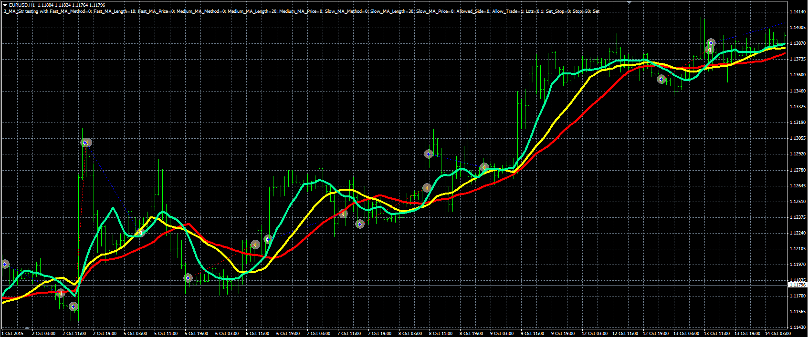

# MA strategy

> Source: https://fxcodebase.com/code/viewtopic.php?f=38&t=63301  
> Forum: 38 · Topic 63301 · 1 post(s)

---

## MA strategy

**Alexander.Gettinger** · Fri Mar 25, 2016 5:03 pm

The strategy based on standard moving average indicator.

Buy condition: the fast MA crosses over the slow MA.
Buy close condition: the fast MA crosses under the medium MA.
Sell condition: the fast MA crosses under the slow MA.
Sell close condition: the fast MA crosses over the medium MA.

 

Download:

 [3_MA_Str.mq4](files/105480/3_MA_Str.mq4)
