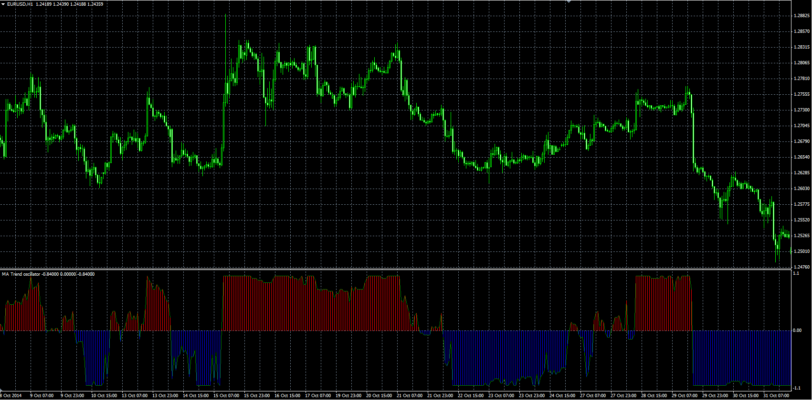

# MA Trend indicator

> Source: https://fxcodebase.com/code/viewtopic.php?f=38&t=61550  
> Forum: 38 · Topic 61550 · 1 post(s)

---

## MA Trend indicator

**Alexander.Gettinger** · Wed Nov 26, 2014 3:23 pm

The indicator analyses [Count_MA] moving averages with first period [Start_Period] and step [Step_Period].

Formula:
MA_Trend = Sum(S)/Count_MA, where
S(i) = 1 if Price>MA(i) and S(i) = -1 if Price<MA(i).

 

Download:

 [MA_Trend.mq4](files/97396/MA_Trend.mq4)
