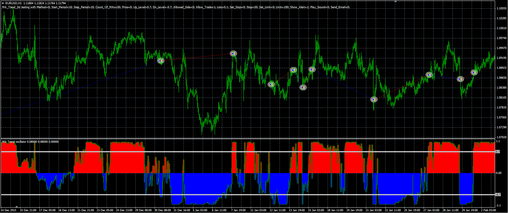

# MA trend strategy

> Source: https://fxcodebase.com/code/viewtopic.php?f=38&t=63282  
> Forum: 38 · Topic 63282 · 1 post(s)

---

## MA trend strategy

**Alexander.Gettinger** · Wed Mar 23, 2016 12:08 pm

The strategy based on MA trend indicator ([viewtopic.php?f=38&t=61550&p=97396](https://fxcodebase.com/code/viewtopic.php?f=38&t=61550&p=97396)).

Buy condition: MA trend crosses over the Up level.
Sell condition: MA trend crosses under the Down level.

 

Download:

 [MA_Trend_Str.mq4](files/105417/MA_Trend_Str.mq4)

MA trend indicator ([viewtopic.php?f=38&t=61550&p=97396](https://fxcodebase.com/code/viewtopic.php?f=38&t=61550&p=97396)) should be installed for correct work.
