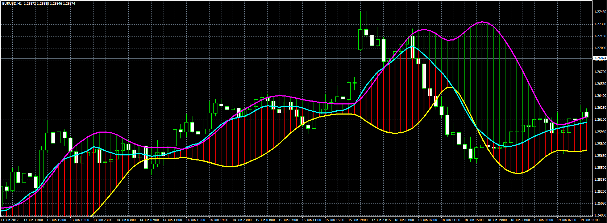

# MA with Band

> Source: https://fxcodebase.com/code/viewtopic.php?f=38&t=20394  
> Forum: 38 · Topic 20394 · 3 post(s)

---

## MA with Band

**Alexander.Gettinger** · Tue Jun 19, 2012 5:30 pm

The indicator draws the moving average and the Bollinger Bands calculated on MA.

 

Download:

 [MA_With_Band.mq4](files/35761/MA_With_Band.mq4)

---

## Re: MA with Band

**alex2011uk** · Tue Jun 26, 2012 6:45 am

Hey ALex!
I need an indicator who color the space between 2 moving average, and I'm using the FXCM TRADING STATION, I tried to download your code but my paltform doen't read the it!
Do u know where I can find something like that!

Thanks
ALex

---

## Re: MA with Band

**Apprentice** · Wed Jun 27, 2012 4:06 am

Try Cloud Indicator....
[viewtopic.php?f=17&t=1589&hilit=cloud](https://fxcodebase.com/code/viewtopic.php?f=17&t=1589&hilit=cloud)

F.Y.I. Mq4 is used for the MT4 platform.
Lua on the other hand for TradeStation / Marketscope.
