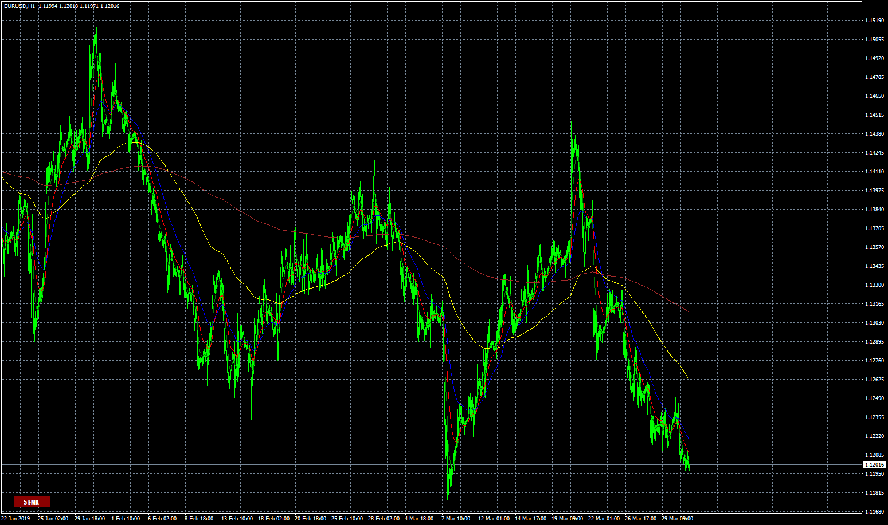

# ma_with_button

> Source: https://fxcodebase.com/code/viewtopic.php?f=38&t=68338  
> Forum: 38 · Topic 68338 · 13 post(s)

---

## ma_with_button

**Apprentice** · Mon Apr 15, 2019 5:11 am

Based on request.
[viewtopic.php?f=27&t=68176](https://fxcodebase.com/code/viewtopic.php?f=27&t=68176)

 [ma_with_button.mq4](files/125751/ma_with_button.mq4)

---

## Re: ma_with_button

**TheGMan** · Sun Apr 21, 2019 1:00 am

What can I say? Fantastic job! Perfecto!

Thanks again, Apprentice!

G

---

## Re: ma_with_button

**TheGMan** · Sun Apr 21, 2019 1:47 am

Hi Apprentice

Everything is great with this ma_with_button.mq4 indicator except, if the MA's are turned off it is turning the MA's back on automatically if you switch to a different time frame. If I remember correctly I believe that the Channels Button Indicator did the same thing & you were able to fix it so not to turn on when switching time frames.

Can you please correct this ma_with_button.mq4 so that it is not turning on the MA's when you switch time frames?

Thank you in advance1

G

---

## Re: ma_with_button

**Apprentice** · Sun Apr 21, 2019 3:57 am

Your request is added to the development list under Id Number 4605

---

## Re: ma_with_button

**Apprentice** · Tue Apr 23, 2019 7:21 am

Try it now.

---

## Re: ma_with_button

**TheGMan** · Wed Apr 24, 2019 7:09 am

> **Apprentice wrote:**
> Try it now.

Hi Apprentice

It is still doing the same thing. If the button is turned off & (showing no moving averages) if you then switch time frames the moving averages come back on.

I really appreciate your effort & hope that this can be corrected.

Thank you
G

---

## Re: ma_with_button

**Apprentice** · Fri Apr 26, 2019 6:06 am

Can't repeat it. Try to download the indicator from different computer or browser, clear your web browser's cache.

---

## Re: ma_with_button

**TheGMan** · Fri Apr 26, 2019 6:31 am

> **Apprentice wrote:**
> Can't repeat it. Try to download the indicator from different computer or browser, clear your web browser's cache.

Not sure what was happening but all is good now!

Thanks again, Apprentice! You guys are the best!

G

---

## Re: ma_with_button

**mipro66** · Fri May 03, 2019 8:55 am

dear Apprentice,
thank you very much for the ma_button. I love it so much and use it every day.

I would like to build my own menu button but i´m not a profi coder as you.
I can read code and use code snippet to modify my indis for my use. (eg. other color or levels).

I´ve tried to program a hma indi with this button function, but I had no success

Is it possible for you to give an other example, eg. with this hma ?
And my second question is, is it possible to create such buttons for subwindows?
Thanks in advanced
many greetings
Markus

---

## Re: ma_with_button

**mipro66** · Sat May 04, 2019 7:00 pm

Hello
I´ve tried it by myself but I´ve got 4 faults and I can´t find the solution.
Is there anybody to help?
best greetings
Markus

---

## Re: ma_with_button

**Apprentice** · Mon May 06, 2019 4:52 am

Your request is added to the development list under Id Number 4638

---

## Re: ma_with_button

**Apprentice** · Wed May 08, 2019 3:54 pm

Try this version.

 [HMA nrp alerts + arrows with buttons.mq4](files/126234/HMA%20nrp%20alerts%20arrows%20with%20buttons.mq4)

---

## Re: ma_with_button

**mipro66** · Fri May 10, 2019 2:53 pm

thank you very much Apprentice,
that´s great
I´ll try it to convert it to an other indi myself.
best weekend for you
greetings
Markus
