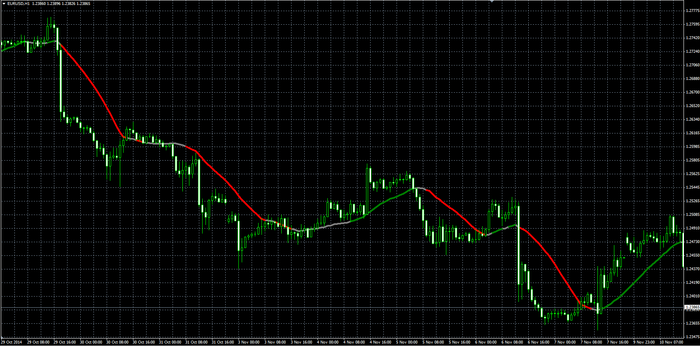

# MA with Filter

> Source: https://fxcodebase.com/code/viewtopic.php?f=38&t=61516  
> Forum: 38 · Topic 61516 · 1 post(s)

---

## MA with Filter

**Alexander.Gettinger** · Fri Nov 21, 2014 4:57 pm

Original LUA indicator: [viewtopic.php?f=17&t=4807](https://fxcodebase.com/code/viewtopic.php?f=17&t=4807).

> This indicator, depending on the selected parameters, paint the moving average line.
>
> Filter calculates the difference between the current period and the period N periods ago.
> Shift. Defines look back period.
> Minimum. Defines the minimum difference that is detected by filter as a change.

 

Download:

 [MA_Filter.mq4](files/97286/MA_Filter.mq4)
