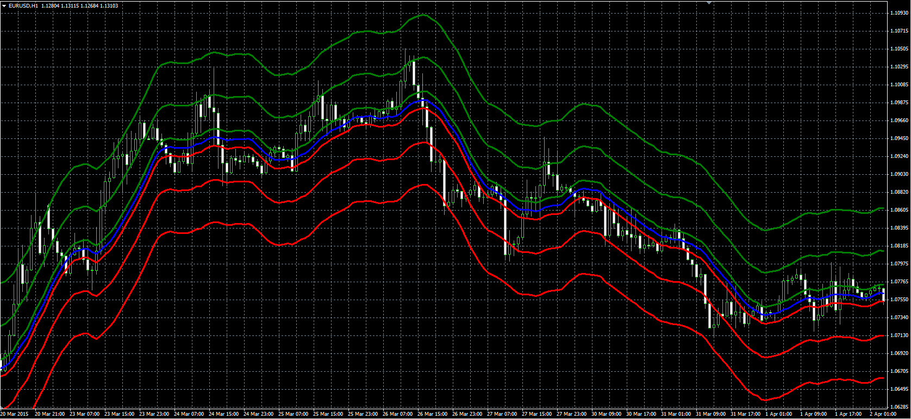

# MA Zone indicator

> Source: https://fxcodebase.com/code/viewtopic.php?f=38&t=62245  
> Forum: 38 · Topic 62245 · 1 post(s)

---

## MA Zone indicator

**Alexander.Gettinger** · Fri May 22, 2015 9:59 am

Original LUA indicator: [viewtopic.php?f=17&t=62092](https://fxcodebase.com/code/viewtopic.php?f=17&t=62092).

Formulas:
Central = MA,
Top1 = Central+Level1,
Bottom1 = Central-Level1,
Top2 = Central+Level2,
Bottom2 = Central-Level2,
Top3 = Central+Level3,
Bottom3 = Central-Level3, where
MA - Moving average(Price) with [Length] number of periods and [Method] type.

 

Download:

 [MA_Zone.mq4](files/100604/MA_Zone.mq4)
