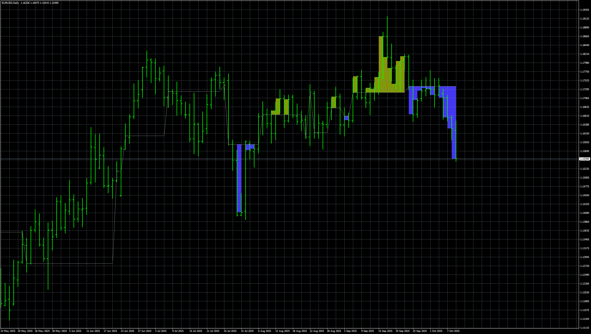

# MACD_Based_Price_Forecasting_5D

> Source: https://fxcodebase.com/code/viewtopic.php?f=38&t=76379  
> Forum: 38 · Topic 76379 · 4 post(s)

---

## MACD_Based_Price_Forecasting_5D

**Apprentice** · Mon Oct 20, 2025 6:21 pm

Based on the request.
[https://fxcodebase.com/code/viewtopic.p ... 52#p155252](https://fxcodebase.com/code/viewtopic.php?f=27&p=155252#p155252)

 [MACD_Based_Price_Forecasting_5D.mq4](files/160930/MACD_Based_Price_Forecasting_5D.mq4)

---

## Re: MACD_Based_Price_Forecasting_5D

**khanatd** · Mon Oct 20, 2025 11:48 pm

hi sir plz add mt4 non repaint arrows at close of current candle or reversals/continuations /breakers etc

thanks
khan

---

## Re: MACD_Based_Price_Forecasting_5D

**Apprentice** · Tue Oct 21, 2025 9:43 am

We have added your request to the development list.
Development reference 685

---

## Re: MACD_Based_Price_Forecasting_5D

**Apprentice** · Mon Dec 29, 2025 7:25 am

[MACD_Based_Price_Forecasting_5D_arrow.mq4](files/161438/MACD_Based_Price_Forecasting_5D_arrow.mq4)

Try this version.
