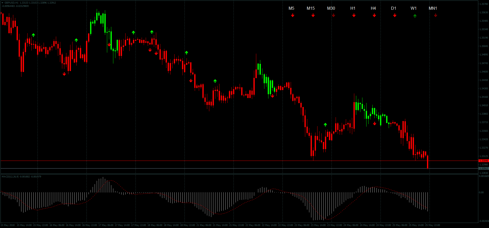

# MACD Candles

> Source: https://fxcodebase.com/code/viewtopic.php?f=38&t=66152  
> Forum: 38 · Topic 66152 · 1 post(s)

---

## MACD Candles

**Apprentice** · Sun May 27, 2018 6:31 pm

LUA Original: [viewtopic.php?f=17&t=11695](https://fxcodebase.com/code/viewtopic.php?f=17&t=11695)

Description:

In this MT4 version of the LUA original indicator, a complete study of the MACD indicator is made:

- The candles have overlay color representing whether the MACD is above or below the Zero Line
- On top or below the bottom of the candles, up and down arrows will show up representing the crossing of the MACD with the Signal Line
- On the upper part a small dashboard is also displayed with the different time frames indicating both their above/below zero line condition plus their MACD/Signal crossing.

 [MACD_Candles.mq4](files/119373/MACD_Candles.mq4)
