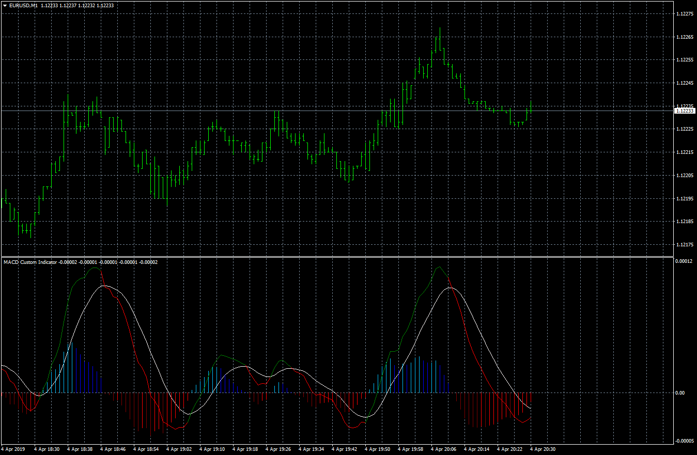
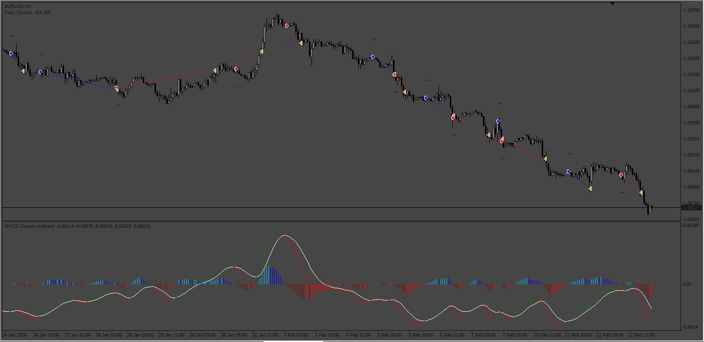
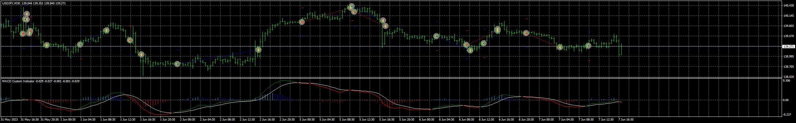

# MACD Custom Indicator

> Source: https://fxcodebase.com/code/viewtopic.php?f=38&t=68302  
> Forum: 38 · Topic 68302 · 16 post(s)

---

## MACD Custom Indicator

**Apprentice** · Thu Apr 04, 2019 5:27 pm

Based on request.
[viewtopic.php?f=27&t=68300](https://fxcodebase.com/code/viewtopic.php?f=27&t=68300)

 [MACD Custom Indicator.mq4](files/125581/MACD%20Custom%20Indicator.mq4)

 

 [MACD_Custom_Indicator_MTF.mq4](files/125581/MACD_Custom_Indicator_MTF.mq4)

 [MACD Custom Indicator.mq5](files/125581/MACD%20Custom%20Indicator.mq5)

Indicator based strategy
[https://fxcodebase.com/code/viewtopic.php?f=38&t=68302](https://fxcodebase.com/code/viewtopic.php?f=38&t=68302)

---

## Re: MACD Custom Indicator

**swnlobo** · Wed Oct 02, 2019 3:47 pm

Almost Sir - I want, for example, the slow MA to be exponential while the fast MA to be nonlag/zerolag ( if possible many options available for slow and fast MA's to later compare the distance between the two MA's.

Thanks

Swnlob0.

---

## Re: MACD Custom Indicator

**Apprentice** · Thu Oct 03, 2019 4:49 am

Your request is added to the development list.
Development reference 155.

---

## Re: MACD Custom Indicator

**Apprentice** · Wed Oct 09, 2019 1:39 pm

[MACD_Custom_averages_Indicator.mq4](files/129077/MACD_Custom_averages_Indicator.mq4)

Try this version.

---

## Re: MACD Custom Indicator

**swnlobo** · Wed Oct 09, 2019 4:20 pm

> **Apprentice wrote:**
>
>
> MACD_Custom_averages_Indicator.mq4
>
>
> Try this version.

Thank You so much Apprentice

All the Best

---

## Re: MACD Custom Indicator

**Gilles** · Sun Jun 07, 2020 4:22 pm

Hi Apprentice,

Please a MACD Custom Indicator.mq4 convert it to mq5 version :) !

Thank you.

---

## Re: MACD Custom Indicator

**Apprentice** · Sun Jun 07, 2020 7:43 pm

Your request is added to the development list.
Development reference 1436.

---

## Re: MACD Custom Indicator

**Apprentice** · Thu Jun 18, 2020 6:12 am

MACD Custom Indicator.mq5 added.

---

## Re: MACD Custom Indicator

**Sensible** · Sun Mar 19, 2023 10:01 am

Please Can you help me to make Mq4 EA out of this MACD Custom indicator to Open Buy and Sell Trade when the two lines Value1 and Value2 within the indicator crossover.

Entry:
Open Buy Trade(Long) when Value1 cross ABOVE Value2 and turn Green.

Open Sell Trade(Short) when Value1 cross BELOW Value2 and turn Red.

Exit:
Close Buy at the Opposite Signal
Close Sell at the Opposite Signal

Input Parameters:
A simple input parameters indicated below only should be include:

-Stoploss in pips (True/False)

-TakeProfit in pips (True/False)

-Tight Trailing Stops in pips (True/False)
TSL Initial step:
TSL Step:
TSL Distance:

-BreakEven with Steps (True/False)
BreakEven Trigger:
BreakEven Target:

-Numbers of open trade

-Push Notification (Desktop, Mobile, Telegram).

Thanks and God bless you and your teams.

---

## Re: MACD Custom Indicator

**Apprentice** · Mon Mar 20, 2023 10:34 am

We have added your request to the development list.
Development reference 251.

---

## Re: MACD Custom Indicator

**Apprentice** · Sat Mar 25, 2023 12:56 pm

Try this version.

 [custom_MACD_ea.mq4](files/150129/custom_MACD_ea.mq4)

MACD Custom Indicator.mq4
[https://fxcodebase.com/code/viewtopic.php?f=38&t=68302](https://fxcodebase.com/code/viewtopic.php?f=38&t=68302)

---

## Re: MACD Custom Indicator

**Sensible** · Mon Apr 03, 2023 10:38 am

> **Apprentice wrote:**
> We have added your request to the development list.
> Development reference 251.

Any Update. Thanks

---

## Re: MACD Custom Indicator

**Sensible** · Wed Apr 05, 2023 10:34 am

> **Apprentice wrote:**
>
>
> 251pic.png
>
>
> Try this version.
>
>
> custom_MACD_ea.mq4

I don't know what to say again. I was the one that requested IMACD_EA to be developed, when it was developed. I tested it and it was not opening any trade when tested on strategy tester and you later reply that it working fine. I have to retest it and it was only opening sell trade and in the cause of correcting and waiting I search any related MACD on this platform and I came across this very MACD Custom Indicator and I request for this EA version of it.

So I abandon IMACD_EA correction and opt for MACD Custom Indicator because of his uniqueness of change of colour thought they are similar.

And now it was IMACD_EA that was copy and paste for me as MACD Custom Indicator_EA giving me the same issue of opening only sell trade I encounter with IMACD_EA.

And to be sure I am not the one doing wrong thing I have to delete every macd related indicator and EA on my mt4 leaving only MACD Custom indicator and EA and what appear on strategy tester heading is IMACD with the same issue.

so help help me to develop it base on MACD Custom Indicator I requested for stated below;

**Please Can you help me to make Mq4 EA out of this MACD Custom indicator to Open Buy and Sell Trade when the two lines Value1 and Value2 within the indicator crossover and change colour.

Entry:
Open Buy Trade(Long) when Value1 cross ABOVE Value2 and turn Green.

Open Sell Trade(Short) when Value1 cross BELOW Value2 and turn Red.

Exit:
Close Buy at the Opposite Signal
Close Sell at the Opposite Signal

Input Parameters:
A simple input parameters indicated below only should be include:

-Stoploss in pips (True/False)

-TakeProfit in pips (True/False)

-Tight Trailing Stops in pips (True/False)
TSL Initial step:
TSL Step:
TSL Distance:

-BreakEven with Steps (True/False)
BreakEven Trigger:
BreakEven Target:

-Numbers of open trade

-Push Notification (Desktop, Mobile, Telegram).**

---

## Re: MACD Custom Indicator

**Sensible** · Thu Apr 06, 2023 2:50 am

Hi Apprentice,

I really appreciate the Job done here,

Please help me to look into this EA development. I tried to retest it again without Takeprofit or Stoploss and I set it, to close at opposite signal. It only Opening Short trade(SELL) and it didn't close it at opposite signal and kept it open until I close it myself and when I also set it to Reversal it only open Long trade(Buy) too.

Help me to make it to work on fast and slow Ema crossover just like 2Ema crossing over.

Please and Please I am relying on this MACD Custom Indicator_EA to take a trade

I will appreciate it if you can help me to perfect it working.

Thanks in advance

---

## Re: MACD Custom Indicator

**Apprentice** · Wed Apr 12, 2023 4:09 am

We have added your request to the development list.
Development reference 329.

---

## Re: MACD Custom Indicator

**Apprentice** · Wed Jun 07, 2023 9:10 am

 [MACD Custom Indicator.mq4](files/151159/MACD%20Custom%20Indicator.mq4)

 [CUSTOM_MACD_EA_v1.00.mq4](files/151159/CUSTOM_MACD_EA_v1.00.mq4)
