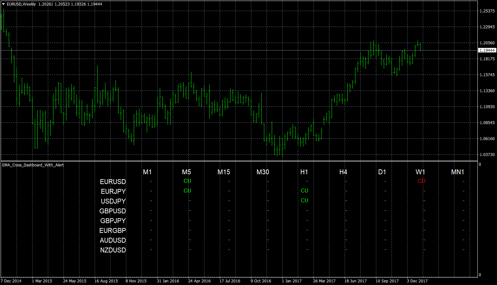

# MACD_Dashboard_With_Alert

> Source: https://fxcodebase.com/code/viewtopic.php?f=38&t=65616  
> Forum: 38 · Topic 65616 · 7 post(s)

---

## MACD_Dashboard_With_Alert

**Apprentice** · Tue Jan 09, 2018 6:12 am

The indicator finds the MACD/Signal intersections and gives an alert.

 [MACD_Dashboard_With_Alert.mq4](files/116929/MACD_Dashboard_With_Alert.mq4)

---

## Re: MACD_Dashboard_With_Alert

**idwusen** · Tue Mar 03, 2020 6:23 am

I have downloaded the MACD_Dashboard_With_Alert for MT4
It is very good and very beneficial.

I have a few request and suggestions;

Is it possible to code in Push Notification Alert for MT4 version?

Also, can the dashboard font size or cells either be made smaller to fit in atleast 36 currency pairs in 1 window, or to make the window enabled to scroll up/down?

Finally can you add the different types of Moving Averages (Simple, Exponential, Smoothed, Linear Weighted) with their corresponding Periods and Shifts of these various Moving Averages into this wonderful Dashboard indicator?

Thank you very much for your anticipated cooperation and reply!

---

## Re: MACD_Dashboard_With_Alert

**Apprentice** · Tue Mar 03, 2020 7:08 am

Your request is added to the development list.
Development reference 811.

---

## Re: MACD_Dashboard_With_Alert

**Apprentice** · Wed Mar 04, 2020 6:05 am

[MACD_Dashboard_With_Alert.mq4](files/131690/MACD_Dashboard_With_Alert.mq4)

Should work with
[viewtopic.php?f=38&t=67050](https://fxcodebase.com/code/viewtopic.php?f=38&t=67050)
and
[viewtopic.php?f=38&t=68302](https://fxcodebase.com/code/viewtopic.php?f=38&t=68302)

---

## Re: MACD_Dashboard_With_Alert

**idwusen** · Sun Apr 12, 2020 7:18 pm

Dear Sir/Madam,

Thank you for adding a mobile phone push alert notification to this wonderful indicator.

Please in addition to the Push alert notification, could you kindly make this indicator to accept changes from the default parameter settings to a different setting of our choice?

The default setting of this indicator are;

Fast ema period: 12
Slow ema period: 26
Signal period: 9

The problem is that if I change this default settings of this indicator to any numbers that is different from the default numbers, this indicator will not give any signal at all.
This indicator only works and gives signals only in the default numbers settings above.

Please kindly make this indicator to accept changes from the default settings to other number settings so that we can be ale to make changes to the default parameters settings and still make good use of it.

Thank you very much. I look forward to your early reply and solution to the problem.

Best regards,
Wusen

---

## Re: MACD_Dashboard_With_Alert

**Apprentice** · Mon Apr 13, 2020 3:54 am

Your request is added to the development list.
Development reference 1062.

---

## Re: MACD_Dashboard_With_Alert

**Apprentice** · Tue Apr 21, 2020 9:54 am

I don't have any issues with non standard parameters. But the higher periods you choose, the less signals you will get.
