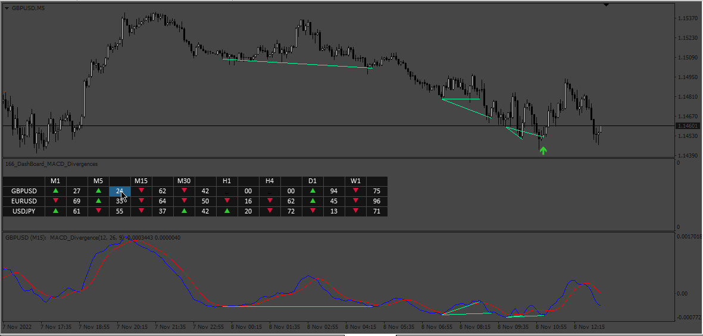

# MACD_Divergence

> Source: https://fxcodebase.com/code/viewtopic.php?f=38&t=72919  
> Forum: 38 · Topic 72919 · 9 post(s)

---

## MACD_Divergence

**Apprentice** · Tue Nov 08, 2022 9:43 am

Based on the request.
[https://fxcodebase.com/code/viewtopic.php?f=27&p=145344](https://fxcodebase.com/code/viewtopic.php?f=27&p=145344)

 [MACD_Divergence.mq4](files/148231/MACD_Divergence.mq4)

---

## Re: MACD_Divergence

**ben3131** · Thu Feb 16, 2023 5:08 am

Hello Apprentice,

After analysis of the two files, I think you forgotten to put the file indicator "DashBoard_MACD_Divergences.mq4".

Thanks in advance,
Ben

---

## Re: MACD_Divergence

**Apprentice** · Tue Feb 28, 2023 3:40 am

MACD_Divergence.mq4 added.

---

## Re: MACD_Divergence

**ben3131** · Wed Mar 08, 2023 11:34 am

Hello Apprentice,

I'm sorry to disturb you again, but I don't find in the file indicator "MACD_Divergence.mq4" the code about the MACD dashboard (like shown in black on the graph GBPUSD M5 below).
( => the code of "MACD_Divergence.mq4" added on February 28, 2023 is the same that I've posted on my first message in March 2022)

Thanks for your time and patience
Ben

---

## Re: MACD_Divergence

**jacryptoking** · Mon Jul 10, 2023 1:24 am

The macd divergence indicator needs an amplitude feature that base on zigzag to identify the waves to identify the divergence. So you have a better average closes to pick the divergence swings.

---

## Re: MACD_Divergence

**Frank8093** · Wed Aug 09, 2023 6:43 am

Dear Mario

Good day

Can you use the Zig Zag for detect the divergence in this file.

Many Thanks

Regards
Frank

> **jacryptoking wrote:**
> The macd divergence indicator needs an amplitude feature that base on zigzag to identify the waves to identify the divergence. So you have a better average closes to pick the divergence swings.

---

## Re: MACD_Divergence

**Apprentice** · Wed Aug 16, 2023 3:29 pm

We have added your request to the development list.
Development reference 741.

---

## Re: MACD_Divergence

**Frank8093** · Fri Sep 01, 2023 6:36 am

Dear Mario

Have a good day

Macd Divergence Dashboard .mq4 didn't attach.

please attach macd divergence dashboard .mq4 .

many thanks
Frank

---

## Re: MACD_Divergence

**Apprentice** · Sun Oct 08, 2023 4:13 am

Try this version.
[https://fxcodebase.com/code/viewtopic.php?f=38&t=74229](https://fxcodebase.com/code/viewtopic.php?f=38&t=74229)
