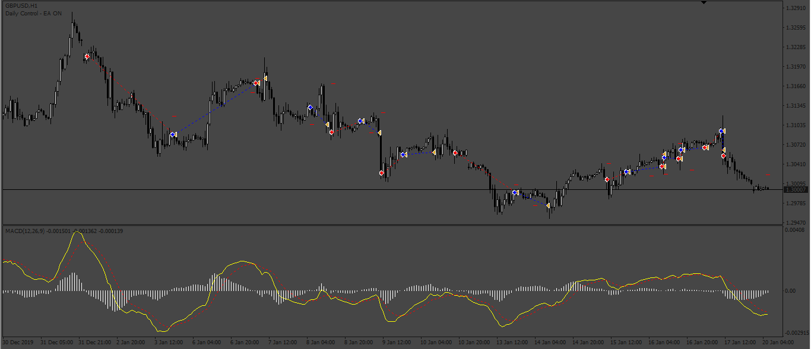

# MACD_EA

> Source: https://fxcodebase.com/code/viewtopic.php?f=38&t=73494  
> Forum: 38 · Topic 73494 · 3 post(s)

---

## MACD_EA

**Apprentice** · Sat Mar 18, 2023 2:33 am

Based on the request.
[https://fxcodebase.com/code/viewtopic.php?f=27&p=149933](https://fxcodebase.com/code/viewtopic.php?f=27&p=149933)

 [IMACD.mq4](files/150035/IMACD.mq4)

 [MACD_EA.mq4](files/150035/MACD_EA.mq4)

---

## Re: MACD_EA

**Sensible** · Sun Mar 19, 2023 10:17 am

Hi Apprentice,

Thanks for working on this indicator.

I tried to backtest this MACD_EA on Mt4 Strategy tester and it not taking any trade and I tried delete all already macd and imacd indicator installed and redownload yet is not taking any trade.

My second observation while backtesting when running the indicator is not showing but immediately I stop it, it appear

Please help me to look into it

---

## Re: MACD_EA

**Apprentice** · Mon Mar 20, 2023 10:24 am

I just test it in backtested, without problems.
