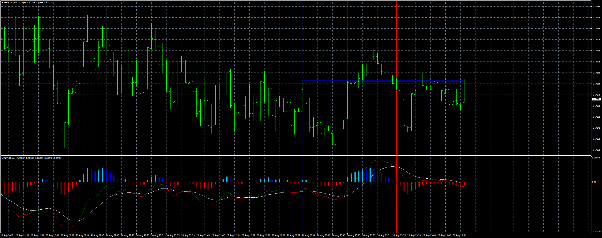

# MACD_Helper

> Source: https://fxcodebase.com/code/viewtopic.php?f=38&t=72664  
> Forum: 38 · Topic 72664 · 5 post(s)

---

## MACD_Helper

**Apprentice** · Sun Aug 28, 2022 1:40 am

Based on TS2 original
[https://fxcodebase.com/code/viewtopic.php?f=17&p=147224](https://fxcodebase.com/code/viewtopic.php?f=17&p=147224)

 [MACD_Helper.mq4](files/147246/MACD_Helper.mq4)

---

## Re: MACD_Helper

**tutumlgb** · Thu Oct 13, 2022 2:57 pm

> **Apprentice wrote:**
>
>
> gbpusd-m1-forex-capital-markets.png
>
>
> Based on TS2 original
> [https://fxcodebase.com/code/viewtopic.php?f=17&p=147224](https://fxcodebase.com/code/viewtopic.php?f=17&p=147224)
>
>
> MACD_Helper.mq4

Can you change the color at the inflection point of the slow line in this macd helper? Other colors and indicators are removed,

thank you sir

---

## Re: MACD_Helper

**Apprentice** · Tue Oct 18, 2022 2:13 am

We have added your request to the development list.
Development reference 664.

---

## Re: MACD_Helper

**tutumlgb** · Fri Nov 11, 2022 4:26 am

> **tutumlgb wrote:**
>
>
> > **Apprentice wrote:**
> >
> >
> > gbpusd-m1-forex-capital-markets.png
> >
> >
> > Based on TS2 original
> > [https://fxcodebase.com/code/viewtopic.php?f=17&p=147224](https://fxcodebase.com/code/viewtopic.php?f=17&p=147224)
> >
> >
> > MACD_Helper.mq4
>
>
> Can you change the color at the inflection point of the slow line in this macd helper? Other colors and indicators are removed,
>
> thank you sir

already 2 month

---

## Re: MACD_Helper

**Apprentice** · Mon Jan 20, 2025 10:35 am

I don’t understand what color should be changed to?
