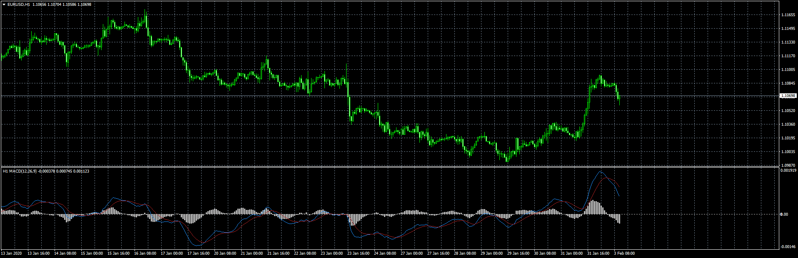
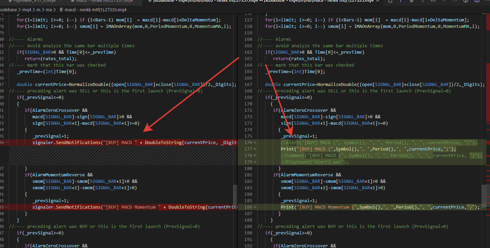

# macd - neskk mtf

> Source: https://fxcodebase.com/code/viewtopic.php?f=38&t=69370  
> Forum: 38 · Topic 69370 · 6 post(s)

---

## macd - neskk mtf

**Apprentice** · Mon Feb 03, 2020 6:48 am

Based on request.
[viewtopic.php?f=27&t=69363](https://fxcodebase.com/code/viewtopic.php?f=27&t=69363)

 [macd - neskk mtf.mq4](files/131047/macd%20-%20neskk%20mtf.mq4)

---

## Re: macd - neskk mtf

**kavoshmasir** · Tue Feb 04, 2020 7:48 am

This one is the same version I'd sent , Could you check the coding ? I think it has a problem in coding , it doesn't send notification.
Thank you so much

---

## Re: macd - neskk mtf

**Apprentice** · Wed Feb 05, 2020 9:25 am

Your request is added to the development list.
Development reference 680.

---

## Re: macd - neskk mtf

**Apprentice** · Wed Feb 05, 2020 10:02 am

it's completely different.

---

## Re: macd - neskk mtf

**kavoshmasir** · Wed Feb 05, 2020 5:04 pm

Yes , You are right , that is different , I tried this one , the problem remains , it doesn't send notification and doesn't show momentum line.

---

## Re: macd - neskk mtf

**Apprentice** · Fri Feb 07, 2020 6:46 am

[macd - neskk mtf.mq4](files/131162/macd%20-%20neskk%20mtf.mq4)

Try this version.
