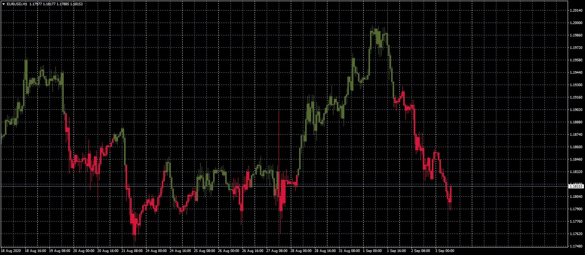

# MACD_Overlay

> Source: https://fxcodebase.com/code/viewtopic.php?f=38&t=70351  
> Forum: 38 · Topic 70351 · 3 post(s)

---

## MACD_Overlay

**Apprentice** · Mon Aug 31, 2020 8:57 am

Based on request.
[viewtopic.php?f=17&t=9806&start=10](https://fxcodebase.com/code/viewtopic.php?f=17&t=9806&start=10)

 

 [MACD_Overlay.mq4](files/137178/MACD_Overlay.mq4)

---

## MACD_Overlay

**taipan** · Mon Aug 31, 2020 6:30 pm

Hi Mario,

This is not Aaron Oscillator, please rectify the file.

Thanks,
taipan

---

## MACD_Overlay

**Apprentice** · Thu Sep 03, 2020 2:44 am

Try it now.
