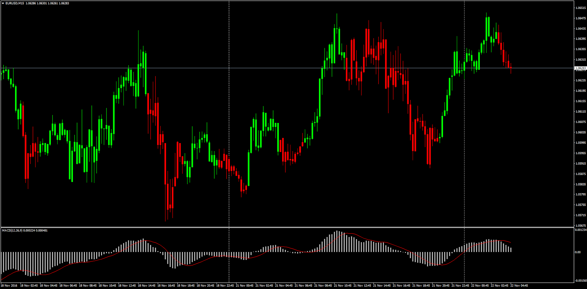

# MACD, RSI & Stochastic Price Overlay

> Source: https://fxcodebase.com/code/viewtopic.php?f=38&t=64125  
> Forum: 38 · Topic 64125 · 3 post(s)

---

## MACD, RSI & Stochastic Price Overlay

**Apprentice** · Tue Nov 22, 2016 4:30 pm

 

 

LUA Original: [viewtopic.php?f=17&t=2006](https://fxcodebase.com/code/viewtopic.php?f=17&t=2006) and [viewtopic.php?f=17&t=2438](https://fxcodebase.com/code/viewtopic.php?f=17&t=2438)

Description:

MACD Overlay will color the candles bullish or bearish depending on 3 available modes:

1) Compare MACD Main and Signal Lines
2) MACD above or below Zero Line
3) Compare Current MACD value with Previous MACD value

RSI Overlay will color the candles bullish, bearish or neutral depending on 3 available modes:

1) RSI Above or Below 50 Line
2) Compare Current RSI value with Previous RSI value
3) RSI Above Overbought Level or Below Oversold Level

Stochastics Overlay will color the candles bullish, bearish or neutral depending on 4 available modes:

1) Compare Stochastic Main and Signal Lines
2) Stochastic Above or Below 50 Line
3) Compare Current Stochastic Value with Previous Stochastic value
4) Stochastic Above Overbought Level or Below Oversold Level

A combination of other conditions with more than one indicator can be made for a future task, including alerts when certain scenario occures, so the option is open for future development

 [RSI_Overlay.mq4](files/109166/RSI_Overlay.mq4)

 [Stochastics_Overlay.mq4](files/109166/Stochastics_Overlay.mq4)

 [MACD_Overlay.mq4](files/109166/MACD_Overlay.mq4)

---

## Re: MACD, RSI & Stochastic Price Overlay

**ramzam** · Wed Jun 14, 2017 8:18 pm

​i came to get this ​indicator from my friend. we don't know how to coding. but when i try to open mq4 file, i found your mail id there. so conveyed mail and redirected here
 can you please do a favour to us...

 as per this indicator rsi above 70 is green and below 30 is red...

where as i want if rsi above 90 / 95 darkgreen color and below 10 / 5 maroon color..it means darken colors.... is my request.....
can you do this favour please ...

one more idea is it possible or not i don't know according to the value of rsi... from light color to darken...step by step.... means rsi below 50 rsi 45 light red rsi 40 little dark.... rsi 35 little more dark.... rsi 30 again into dark...upto rsi 10 to 5........extra dark... above rsi 50 like wise light green to darker shades.... when above 90 to 95 extra dark in color... it resembles... good for idea but not sure into indicator making...

---

## Re: MACD, RSI & Stochastic Price Overlay

**ramzam** · Wed Jun 14, 2017 9:16 pm

REGARDING STOCHASTIC PRICE OVERLAY
IN STOCHASTIC IT IS CATCHING THE BOTTOM AND TOP.. BUT CAN YOU MIX THIS STOCHASTIC 50 LINE AND STOCHASTIC SIGNAL.. BECAUSE
present condition is only to view below above 50 level. suppose take trade meas no loss no gain type it results....

base is above 50 is bullish below 50 is bearish.. the same below 5 to 0 any signal gets means it is worthy to catch bottom so highlighting this area with other color and above 95 to 100 also to catch the top...means so good
please consider this too.... or stochastic comparison too...
