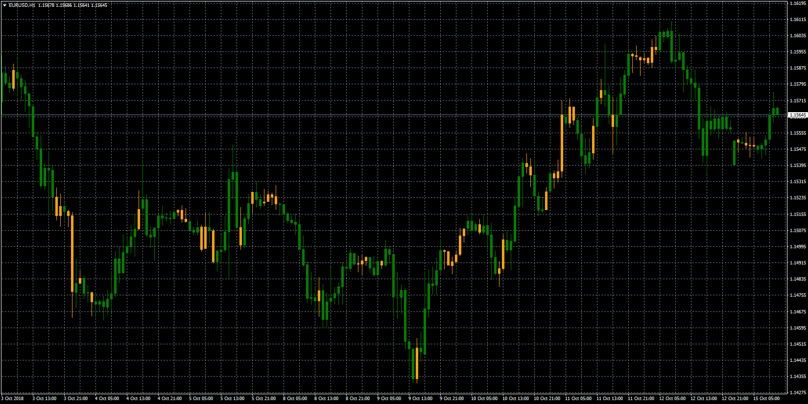

# MACD Slow Stochastic Overlay

> Source: https://fxcodebase.com/code/viewtopic.php?f=38&t=66828  
> Forum: 38 · Topic 66828 · 1 post(s)

---

## MACD Slow Stochastic Overlay

**Apprentice** · Mon Oct 15, 2018 5:04 am

Based on lua original
[viewtopic.php?f=17&t=66700](https://fxcodebase.com/code/viewtopic.php?f=17&t=66700)

Up Trend
K-line has upslope
MACD Histogram line has upslope
Down Trend
K-line has downslope
MACD Histogram line has downslope
else
Neutral Trend

 [MACD Slow Stochastic Overlay.mq4](files/121599/MACD%20Slow%20Stochastic%20Overlay.mq4)
