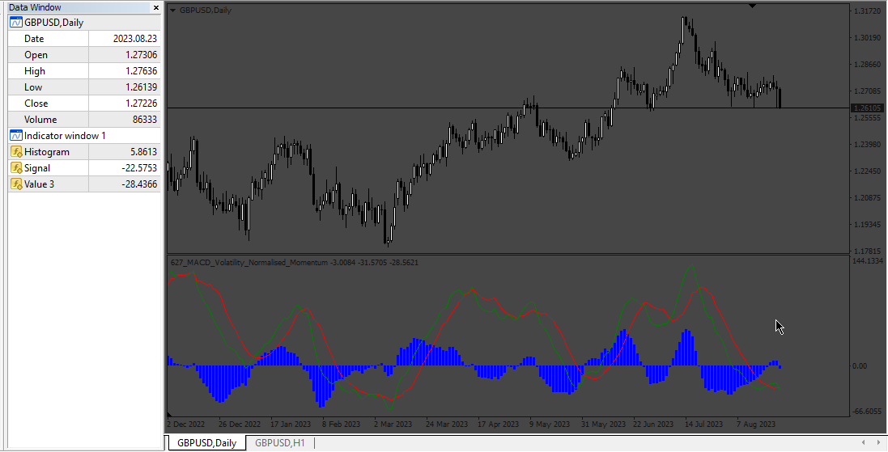

# MACD_Volatility_Normalised_Momentum

> Source: https://fxcodebase.com/code/viewtopic.php?f=38&t=74070  
> Forum: 38 · Topic 74070 · 4 post(s)

---

## MACD_Volatility_Normalised_Momentum

**Apprentice** · Fri Aug 25, 2023 2:06 am

Based on TS2 version.
[https://fxcodebase.com/code/viewtopic.p ... 54#p151654](https://fxcodebase.com/code/viewtopic.php?f=17&p=151654#p151654)

 [MACD_Volatility_Normalised_Momentum.mq4](files/152227/MACD_Volatility_Normalised_Momentum.mq4)

---

## Re: MACD_Volatility_Normalised_Momentum

**Meno.Sebastiano** · Sun Oct 05, 2025 11:19 am

Thank you for this valuable site. Got a lot of indis to try on. I find this particular indi good. However, tried using this in iCustom but got errors. How to resolve?

52 bytes of leaked memory
1 leaked strings left
1 object of tyoe MACD left
1 undeleted objects left

Thank you.

---

## Re: MACD_Volatility_Normalised_Momentum

**Apprentice** · Sun Oct 12, 2025 2:42 am

We have added your request to the development list.
Development reference 665

---

## Re: MACD_Volatility_Normalised_Momentum

**Apprentice** · Wed Oct 29, 2025 4:08 pm

[MACD_Volatility_Normalised_Momentum_v2.mq4](files/161096/MACD_Volatility_Normalised_Momentum_v2.mq4)

Try this version.
