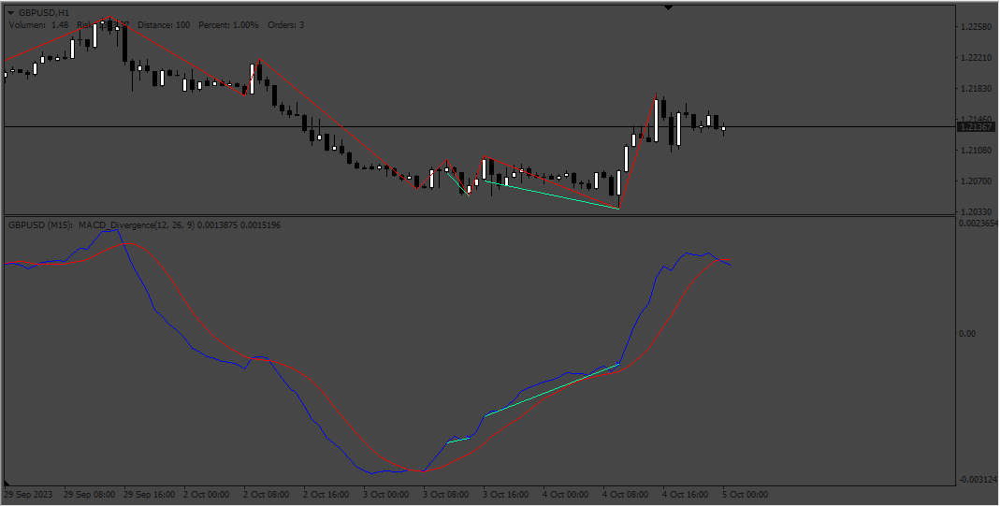

# MACD_ZigZag_Divegence

> Source: https://fxcodebase.com/code/viewtopic.php?f=38&t=74229  
> Forum: 38 · Topic 74229 · 4 post(s)

---

## MACD_ZigZag_Divegence

**Apprentice** · Sun Oct 08, 2023 4:10 am

Based on the request.
[https://fxcodebase.com/code/viewtopic.php?f=27&p=152710](https://fxcodebase.com/code/viewtopic.php?f=27&p=152710)

 [MACD_ZigZag_Divegence.mq4](files/152855/MACD_ZigZag_Divegence.mq4)

---

## Re: MACD_ZigZag_Divegence

**khanatd** · Fri Oct 03, 2025 1:24 am

hi sir, plz add NRP arrows in it at close of current candle mt4

thanks
khan

---

## Re: MACD_ZigZag_Divegence

**Apprentice** · Sat Oct 04, 2025 2:40 pm

We have added your request to the development list.
Development reference 627

---

## Re: MACD_ZigZag_Divegence

**Apprentice** · Thu Oct 09, 2025 1:53 pm

[MACD_ZigZag_Divegence_v2.mq4](files/160809/MACD_ZigZag_Divegence_v2.mq4)

Try this version.
