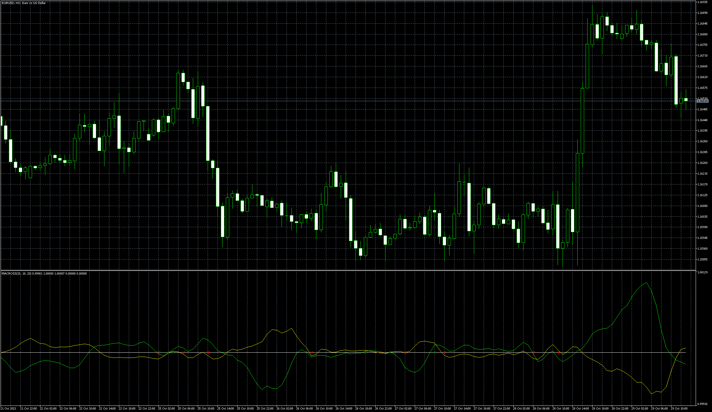

# MACROSS

> Source: https://fxcodebase.com/code/viewtopic.php?f=38&t=71603  
> Forum: 38 · Topic 71603 · 5 post(s)

---

## MACROSS

**Apprentice** · Fri Oct 29, 2021 5:59 am

Based on the request.
[https://fxcodebase.com/code/viewtopic.php?f=38&t=71598](https://fxcodebase.com/code/viewtopic.php?f=38&t=71598)

 [MACROSS.mq5](files/144080/MACROSS.mq5)

MACROSS_opposite
[https://fxcodebase.com/code/viewtopic.p ... 30#p158130](https://fxcodebase.com/code/viewtopic.php?f=38&t=75579&p=158130#p158130)

---

## Re: MACROSS

**ivanpbj** · Sun Oct 31, 2021 7:59 pm

Thanks for the Reply, the arrow should appear when yellow and green crosses the white line, in oposite sides, at the same time, I marked in the print attached to show the crosses,
 And please if we can have the arrows in the main chart to be easier to see, I appreciate your efforts, tks!!

---

## Re: MACROSS

**Apprentice** · Mon Nov 01, 2021 6:42 am

Your request is added to the development list.
Development reference 962.

---

## Re: MACROSS

**Apprentice** · Tue Nov 02, 2021 9:25 am

Try it now.

---

## Re: MACROSS

**ivanpbj** · Tue Nov 02, 2021 9:42 pm

Hello Apprentice, have you updated the file? I downloaded using the same link to check and still the same thing, The arrows are not in the chart, only very small arrows in the indicator window, and still not working. I need it only when we have both lines crossed zero line to opposite sides, at the exactly same time, like that 'X' draw in the last prints I sent, can you please check?
