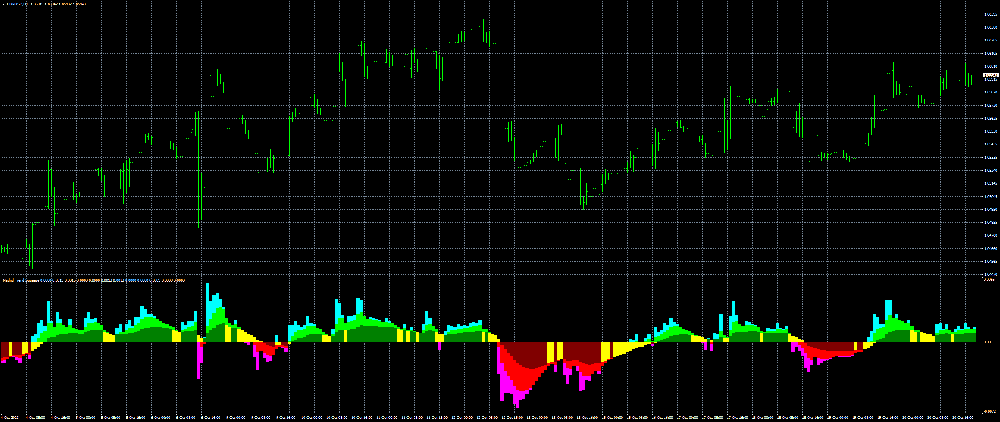

# Madrid_Trend_Squeeze

> Source: https://fxcodebase.com/code/viewtopic.php?f=38&t=74271  
> Forum: 38 · Topic 74271 · 8 post(s)

---

## Madrid_Trend_Squeeze

**Apprentice** · Sat Oct 21, 2023 8:31 am

Based on the request.
[https://fxcodebase.com/code/viewtopic.php?f=27&p=152919](https://fxcodebase.com/code/viewtopic.php?f=27&p=152919)

 [Madrid_Trend_Squeeze.mq4](files/152993/Madrid_Trend_Squeeze.mq4)

TS2 version
[https://fxcodebase.com/code/viewtopic.php?f=17&t=74646](https://fxcodebase.com/code/viewtopic.php?f=17&t=74646)

---

## Re: Madrid_Trend_Squeeze

**[email protected]** · Wed Nov 08, 2023 12:53 pm

Thankyou Sir, wondering will it be possible make it MTF so we can select timeframe..

---

## Re: Madrid_Trend_Squeeze

**Apprentice** · Fri Nov 10, 2023 3:08 pm

We have added your request to the development list.
Development reference 1003

---

## Re: Madrid_Trend_Squeeze

**[email protected]** · Sat Dec 16, 2023 8:16 am

sir any update?

---

## Re: Madrid_Trend_Squeeze

**forexbutton** · Tue Feb 06, 2024 11:59 pm

hi apprendice,

can u make this indicator for trading station

thank u

---

## Re: Madrid_Trend_Squeeze

**Apprentice** · Tue Feb 13, 2024 7:59 am

We have added your request to the development list.
Development reference 155

---

## Re: Madrid_Trend_Squeeze

**Apprentice** · Tue Feb 27, 2024 1:49 pm

TS2 version.
[https://fxcodebase.com/code/viewtopic.php?f=17&t=74646](https://fxcodebase.com/code/viewtopic.php?f=17&t=74646)

---

## Re: Madrid_Trend_Squeeze

**Apprentice** · Wed Jan 15, 2025 5:54 am

 [Madrid_Trend_Squeeze_MTF.mq4](files/157833/Madrid_Trend_Squeeze_MTF.mq4)
