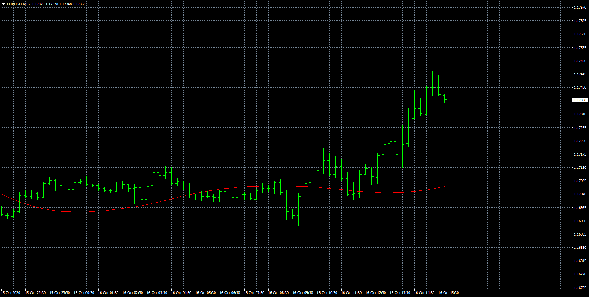

# MaFromMa

> Source: https://fxcodebase.com/code/viewtopic.php?f=38&t=70541  
> Forum: 38 · Topic 70541 · 4 post(s)

---

## MaFromMa

**Apprentice** · Fri Oct 16, 2020 7:49 am

Based on request.
[viewtopic.php?f=27&t=70539](https://fxcodebase.com/code/viewtopic.php?f=27&t=70539)

 [MaFromMa.mq4](files/138313/MaFromMa.mq4)

 [MaFromMaVisual.mq4](files/138313/MaFromMaVisual.mq4)

---

## Re: MaFromMa

**taipan** · Wed Oct 21, 2020 8:54 pm

> **Apprentice wrote:**
>
>
> eurusd-m15-fxcm-australia-pty.png
>
>
> Based on request.
> [viewtopic.php?f=27&t=70539](https://fxcodebase.com/code/viewtopic.php?f=27&t=70539)
>
>
> MaFromMa.mq4
>
>
>
>
> MaFromMaVisual.mq4

Hi Mario,

Where do download the iCanvas.mqh for mt4 version to enable MaFromMaVisual.mq4 indi to work?

taipan

---

## Re: MaFromMa

**Apprentice** · Thu Oct 22, 2020 1:51 am

iCanvas.mqh
[https://www.mql5.com/en/code/24795](https://www.mql5.com/en/code/24795)

---

## Re: MaFromMa

**taipan** · Thu Oct 22, 2020 6:28 pm

> **Apprentice wrote:**
> iCanvas.mqh
> [https://www.mql5.com/en/code/24795](https://www.mql5.com/en/code/24795)

Thanks Mario for the link.

taipan
