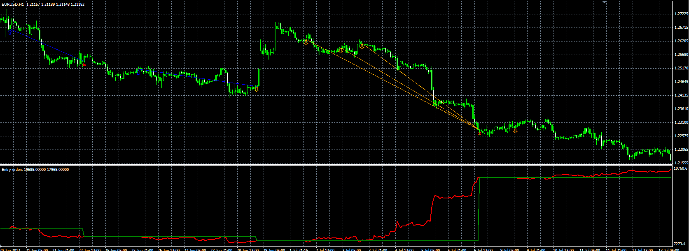

# Manual entry orders indicator

> Source: https://fxcodebase.com/code/viewtopic.php?f=38&t=21218  
> Forum: 38 · Topic 21218 · 1 post(s)

---

## Manual entry orders indicator

**Alexander.Gettinger** · Mon Jul 23, 2012 10:03 am

The indicator provides a possibility for user to place virtual orders on the chart.
For placing orders using arrows ("Arrow up" for BUY, "Arrow down" for SELL and "Stop sign" for close all orders).
Also the indicator draws a graphs of balance and equity.
User can select the type of prices to calculate the balance and equity.
Types of price:
0 - open prices,
1 - high,
2 - low,
3 - close,
4 - median,
5 - typical,
6 - weighted,
7 - best prices (low for BUY, high for SELL),
8 - worst prices (high for BUY, low for SELL).

 

Download:

 [Entry_Orders.mq4](files/37159/Entry_Orders.mq4)

For this indicator must be installed Storage library ([viewtopic.php?f=38&t=21111](https://fxcodebase.com/code/viewtopic.php?f=38&t=21111)).
