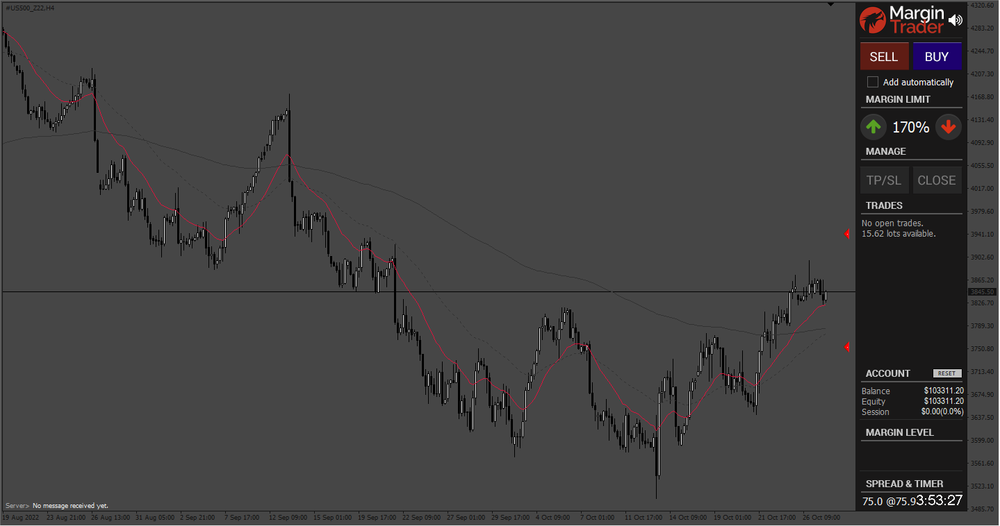
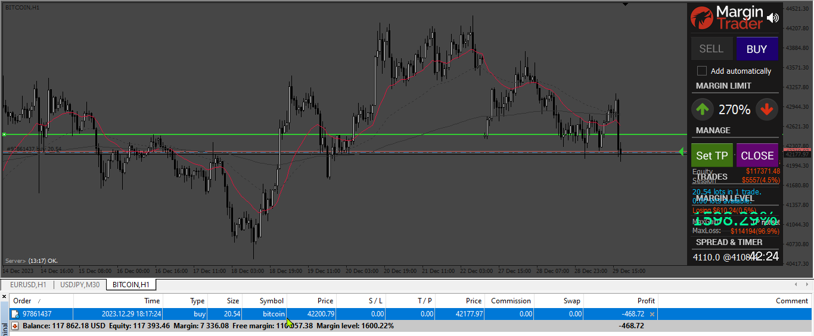

# MarginTrader

> Source: https://fxcodebase.com/code/viewtopic.php?f=38&t=72894  
> Forum: 38 · Topic 72894 · 2 post(s)

---

## MarginTrader

**Apprentice** · Fri Nov 04, 2022 2:50 am

Based on the request.
[https://fxcodebase.com/code/viewtopic.php?f=27&p=148019](https://fxcodebase.com/code/viewtopic.php?f=27&p=148019)

For EX4 contact me via email.
To recompile it you have to put all components in their respective folder.

 [MarginTrader.mq4](files/148140/MarginTrader.mq4)

---

## Re: MarginTrader

**Apprentice** · Wed Jan 03, 2024 5:36 am

Based on the request.
[https://fxcodebase.com/code/viewtopic.php?f=27&p=148157](https://fxcodebase.com/code/viewtopic.php?f=27&p=148157)

 [MarginTrader.mq4](files/153910/MarginTrader.mq4)
