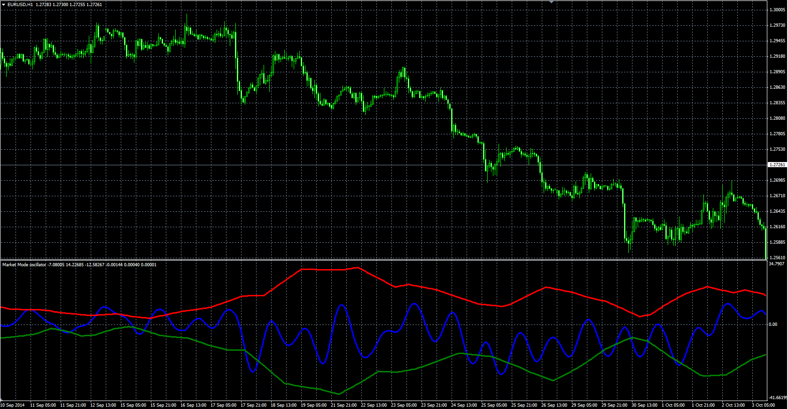

# Market Mode (MM) oscillator

> Source: https://fxcodebase.com/code/viewtopic.php?f=38&t=61386  
> Forum: 38 · Topic 61386 · 1 post(s)

---

## Market Mode (MM) oscillator

**Alexander.Gettinger** · Mon Oct 27, 2014 10:52 am

Original LUA oscillator: [viewtopic.php?f=17&t=24002](https://fxcodebase.com/code/viewtopic.php?f=17&t=24002).

Formulas:
Mode = MVA(BP) with [2*Length+5] number of periods,
Peak = Fract*MVA(fPeak) with 50 number of periods,
Valley = Fract*MVA(fValley) with 50 number of periods, where
BP[i] = 0.25*(1-Alpha)*(High[i]+Low[i]-High[i-2]-Low[i-2])+Beta*(1+Alpha)*BP[i-1]-Alpha*BP[i-2],
fPeak[i] = BP[i-1], if BP[i-1]>BP[i] and BP[i-1]>BP[i-2], else fPeak[i] = fPeak[i-1],
fValley[i] = BP[i-1], if BP[i-1]<BP[i] and BP[i-1]<BP[i-2], else fValley[i]=fValley[i-1],
Alpha = Gamma-Sqrt(Gamma*Gamma-1),
Gamma = 1/cos(4*Pi*Delta/Length),
Beta = cos(2*Pi/Length).

 

Download:

 [MM.mq4](files/96761/MM.mq4)
