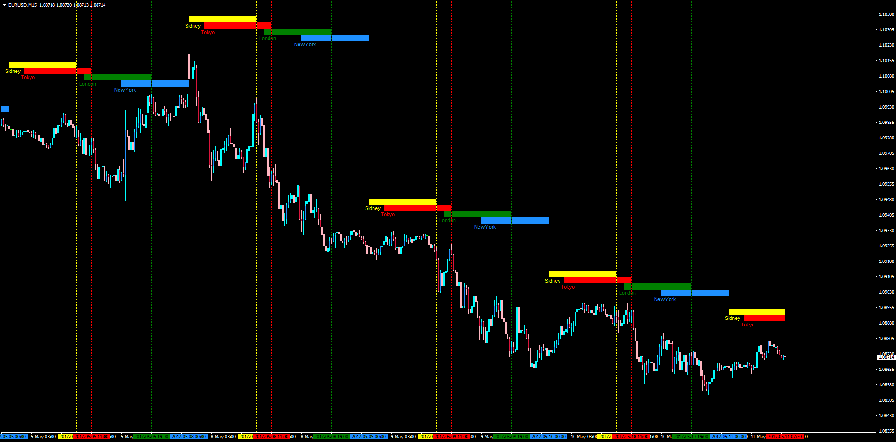

# Market Sessions

> Source: https://fxcodebase.com/code/viewtopic.php?f=38&t=64652  
> Forum: 38 · Topic 64652 · 10 post(s)

---

## Market Sessions

**Apprentice** · Thu May 11, 2017 12:46 pm

Lua Version.
[viewtopic.php?f=17&t=60738&p=111844&hilit=Sessions#p111844](https://fxcodebase.com/code/viewtopic.php?f=17&t=60738&p=111844&hilit=Sessions#p111844)
Description:
This is the MT4 version of this indicator that highlights the New York, London, Tokyo and Sidney Trading Sessions.

Customizable colors, times and end-of-session vertical line.

 [Market_Sessions.mq4](files/112389/Market_Sessions.mq4)

---

## Re: Market Sessions

**Thangaraj** · Tue Oct 06, 2020 7:51 am

> **Apprentice wrote:**
>
>
> Market_Sessions.png
>
>
> Lua Version.
> [viewtopic.php?f=17&t=60738&p=111844&hilit=Sessions#p111844](https://fxcodebase.com/code/viewtopic.php?f=17&t=60738&p=111844&hilit=Sessions#p111844)
> Description:
> This is the MT4 version of this indicator that highlights the New York, London, Tokyo and Sidney Trading Sessions.
>
> Customizable colors, times and end-of-session vertical line.
>
>
> Market_Sessions.mq4

Greetings Sir..! Is it Possible to Add Session Opening vertical Lines To Above Market Sessions.mq4

Thank you so much..!

---

## Re: Market Sessions

**Apprentice** · Wed Oct 07, 2020 2:06 am

Your request is added to the development list.
Development reference 2155.

---

## Re: Market Sessions

**Apprentice** · Thu Oct 08, 2020 2:42 am

[Market_Sessions.mq4](files/138159/Market_Sessions.mq4)

Try this version.

---

## Re: Market Sessions

**clavez** · Sun Oct 11, 2020 11:28 am

awesome indicator!
thanks

---

## Re: Market Sessions

**Thangaraj** · Mon Oct 19, 2020 10:19 pm

> **Apprentice wrote:**
>
>
> Market_Sessions.mq4
>
>
> Try this version.

Thank you so much sir..! Have a Great Day..!

---

## Re: Market Sessions

**Stomp2k** · Fri Jan 01, 2021 8:12 am

Can the levels be made to start painting horizontal at its respective opening price point, also with an option to change width of session lines. And if possible, to add a 5th level(Frankfurt)?

For mt4 please

Thanks in Advance

---

## Re: Market Sessions

**Apprentice** · Sat Jan 02, 2021 2:40 pm

Your request is added to the development list.
Development reference 2.

---

## Re: Market Sessions

**Apprentice** · Sun Jan 03, 2021 5:41 am

[TRADESESSIONS.mq4](files/139933/TRADESESSIONS.mq4)

Try this version.

---

## Re: Market Sessions

**Stomp2k** · Sun Jan 03, 2021 6:03 am

Thanks for quick response.
Frankfurt added and custom line widths perfect.
Ive toggled options and only find high and low
But I am looking for a single line to start at session open price point.

Thanks again in advance
