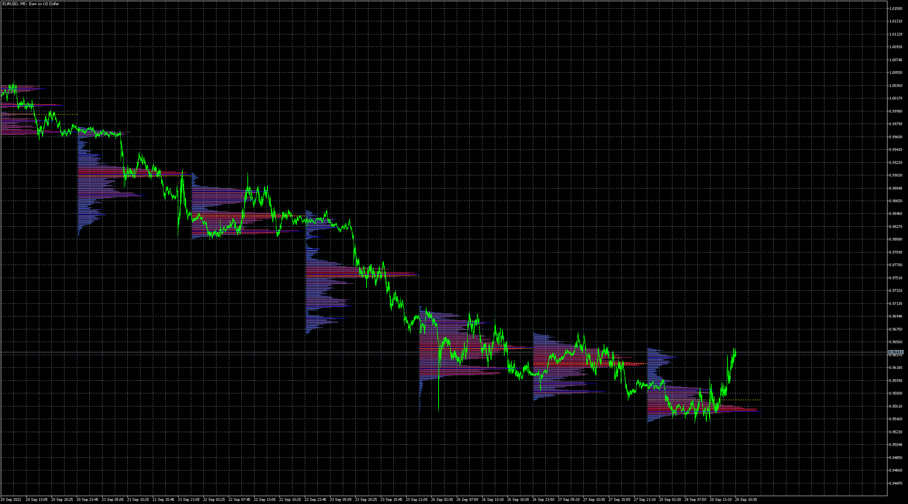

# MarketProfile

> Source: https://fxcodebase.com/code/viewtopic.php?f=38&t=72770  
> Forum: 38 · Topic 72770 · 5 post(s)

---

## MarketProfile

**Apprentice** · Wed Sep 28, 2022 10:38 am

Based on the request.
[https://fxcodebase.com/code/viewtopic.php?f=27&p=147570](https://fxcodebase.com/code/viewtopic.php?f=27&p=147570)

 [MarketProfile.mq5](files/147630/MarketProfile.mq5)

---

## Re: MarketProfile

**Kinslay** · Wed Oct 12, 2022 3:11 am

Hello Apprentice,

Is it possible to add a section concerning transparency in the indicator settings?
Because on some instruments the indicator covers the price.
I noticed there is a "point scale" section but I see it has a few "1, 10, 100" settings.
Can you add others? If you can't, the ideal would be to add a new section dedicated only to the transparency of the indicator.

Thank you

---

## Re: MarketProfile

**Apprentice** · Wed Oct 12, 2022 2:25 pm

We have added your request to the development list.
Development reference 650.

---

## Re: MarketProfile

**Kinslay** · Wed Oct 19, 2022 12:05 pm

Hello Apprentice,

Any news about the request?

Regards

---

## Re: MarketProfile

**Apprentice** · Mon Jan 20, 2025 10:44 am

Added custom scale. MT5 doesn’t support transparency

 [MarketProfile.mq5](files/157908/MarketProfile.mq5)
