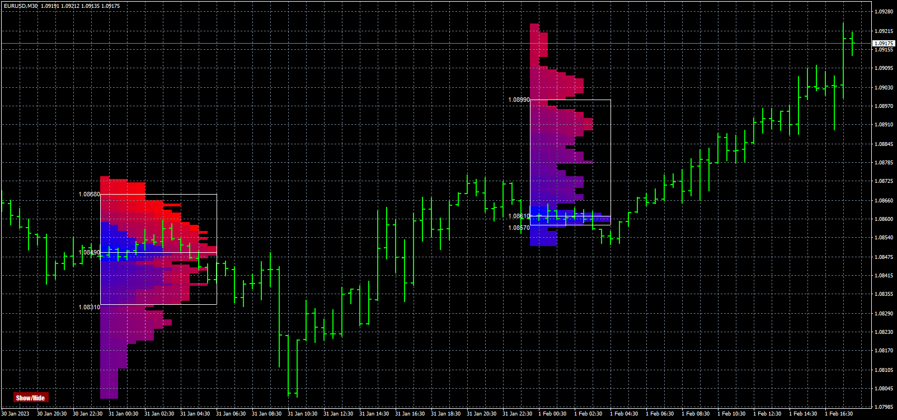

# MarketProfile

> Source: https://fxcodebase.com/code/viewtopic.php?f=38&t=74178  
> Forum: 38 · Topic 74178 · 4 post(s)

---

## MarketProfile

**Apprentice** · Mon Sep 18, 2023 5:49 am

Based on the request.
[https://fxcodebase.com/code/viewtopic.php?f=27&p=152551](https://fxcodebase.com/code/viewtopic.php?f=27&p=152551)

 [MarketProfile.mq4](files/152633/MarketProfile.mq4)

---

## Re: MarketProfile

**Kinslay** · Mon Jan 08, 2024 2:52 am

Hello Apprentice,

Is it possible to include in the indicator settings the ability to change the transparency of the colors of the market profile?
This is because many colors cover the price.
It would be helpful if it could be made more transparent.

Regards

---

## Re: MarketProfile

**Apprentice** · Wed Jan 10, 2024 7:20 am

We have added your request to the development list.
Development reference 45

---

## Re: MarketProfile

**Apprentice** · Wed Jan 15, 2025 4:03 am

Metatrade doesn’t support transparency.
