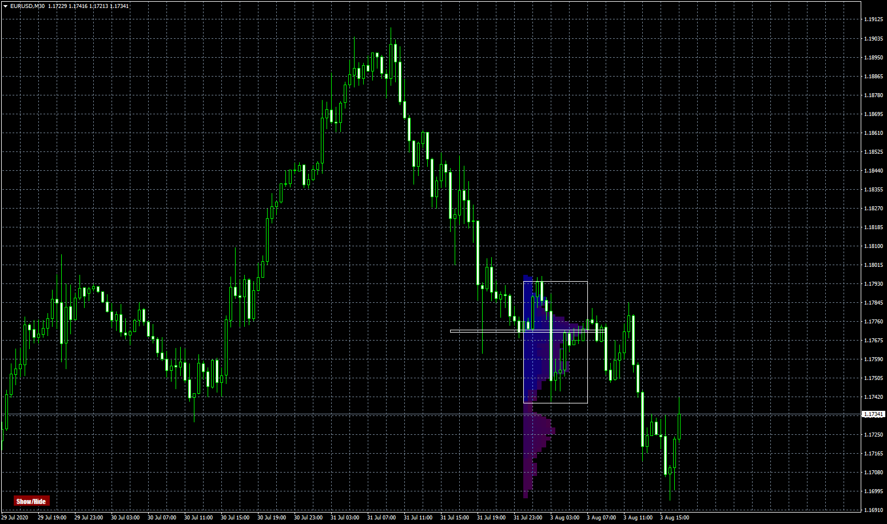
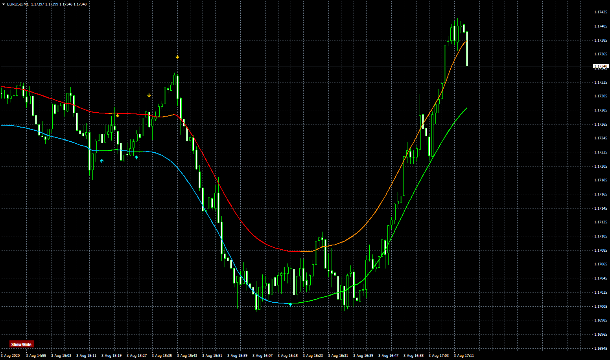
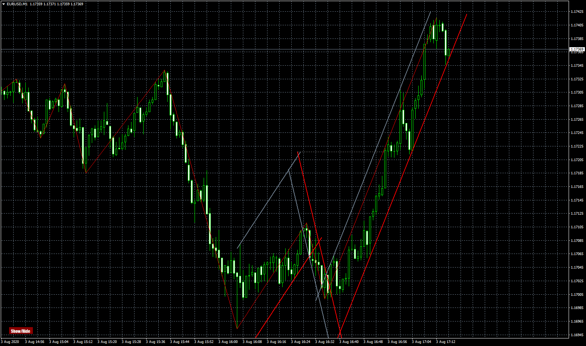

# MarketProfile

> Source: https://fxcodebase.com/code/viewtopic.php?f=38&t=70257  
> Forum: 38 · Topic 70257 · 6 post(s)

---

## MarketProfile

**Apprentice** · Mon Aug 03, 2020 10:58 am

Based on request.
[viewtopic.php?f=27&t=70253](https://fxcodebase.com/code/viewtopic.php?f=27&t=70253)

 [MarketProfile.mq4](files/136543/MarketProfile.mq4)

---

## ZigZagWithChannels

**Apprentice** · Mon Aug 03, 2020 11:00 am

 [ZigZagWithChannels.mq4](files/136544/ZigZagWithChannels.mq4)

---

## TMA+CG 4C AA MTF TT

**Apprentice** · Mon Aug 03, 2020 11:00 am

 [TMA+CG 4C AA MTF TT.mq4](files/136545/TMACG%204C%20AA%20MTF%20TT.mq4)

---

## Re: TMA+CG 4C AA MTF TT

**Banzai** · Tue Aug 04, 2020 11:58 pm

> **Apprentice wrote:**
>
>
> The attachment **3.png** is no longer available
>
>
>
>
> The attachment **3.png** is no longer available

When I click the off button,
there are still some graphics at the bottom.
See where I circle the graphics in the attached picture.

Please fix it. (TMA+CG 4C AA MTF TT.mq4)
Thank you.

---

## Re: MarketProfile

**Apprentice** · Wed Aug 05, 2020 4:12 am

Your request is added to the development list.
Development reference 1828.

---

## Re: MarketProfile

**Apprentice** · Thu Aug 06, 2020 6:02 am

Try it now.
