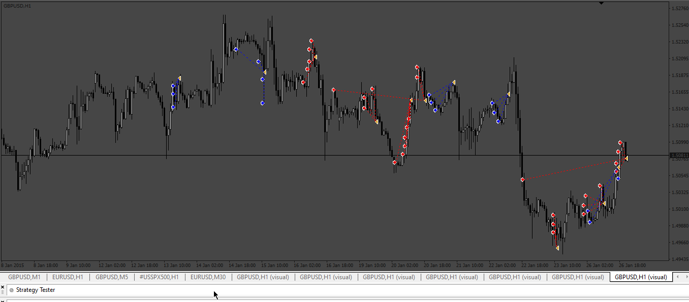
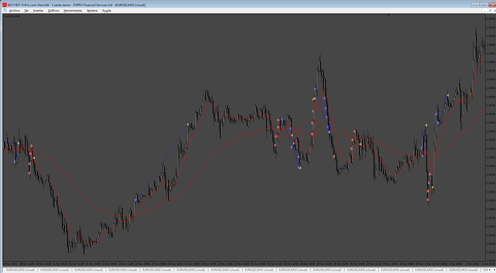
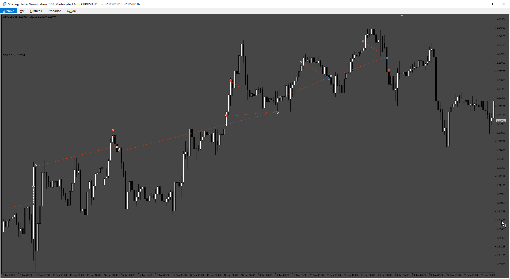

# Martingale_EA

> Source: https://fxcodebase.com/code/viewtopic.php?f=38&t=73496  
> Forum: 38 · Topic 73496 · 17 post(s)

---

## Martingale_EA

**Apprentice** · Sat Mar 18, 2023 2:55 am

Based on the request.
[https://fxcodebase.com/code/viewtopic.php?f=38&t=73478](https://fxcodebase.com/code/viewtopic.php?f=38&t=73478)

 [Martingale_EA.mq4](files/150040/Martingale_EA.mq4)

---

## Re: Martingale_EA

**aloorkar** · Sun Mar 19, 2023 10:53 am

Not working as i written in description .. ( Image)

---

## Re: Martingale_EA

**gerryj1968** · Mon Mar 20, 2023 7:56 am

Hi, thanks for this. I'm new to your platform, I'm giving this EA a go in a Demo account.
I have a real account running a paid (profitable) EA which operates a Martingale type strategy but it's done in such a way that I can't see the code.
I want to try and understand the code behind the EA's so I can tweak and edit to perfect a strategy better.
I've been trading stocks for several years but have never been able to manage the emotional side of trading so I thought I'd give FOREX a go, and in particular algo trading so I can fire and forget...

Thanks again!

---

## Re: Martingale_EA

**Apprentice** · Mon Mar 20, 2023 10:21 am

aloorkar can you provide a bit more information?

---

## Re: Martingale_EA

**gerryj1968** · Mon Mar 20, 2023 11:49 am

Hi, I've noticed that the EA seems to throw out 0.01 buys and sells simultaneously. It doesn't appear to be scaling up.
Shouldn't it put increasingly larger sells if the price is moving up (short) or increasingly larger buys if the price is moving down (long)? Then take profit on the pull back?

---

## Re: Martingale_EA

**gerryj1968** · Fri Mar 24, 2023 8:37 am

Hi, as Akoorla says this EA isn't working as it should I don't this. It just throws out 0.01 buys and sells as levels and doesn't scale into a position, doubling the previous entry and taking profit on the pullback (long or short).
It would be great if you could tweak it so it achieves this.
For me the scaled adds would be on the hourly candle close 'if' its moved 10+ pips (adjustable if possible)

Thanks
gerryj

---

## Re: Martingale_EA

**Apprentice** · Sat Mar 25, 2023 1:08 pm

We have added your request to the development list.
Development reference 267.

---

## Re: Martingale_EA

**Apprentice** · Sun Apr 23, 2023 2:57 pm

 [Martingale_EA_v2_First_mannually.mq4](files/150566/Martingale_EA_v2_First_mannually.mq4)

---

## Re: Martingale_EA

**gerryj1968** · Mon May 01, 2023 3:43 pm

Thanks! Will give this version a go.
Appreciated!

---

## Re: Martingale_EA

**gerryj1968** · Tue May 02, 2023 3:26 pm

Hi,On the 'about' page it says
"1. First trade must be made manually and the magic number must be zero (0)"
Does this mean I have to manually make the first trade. If so what lot size, which direction long or short?
What is the magic number and where do I set it to zero?
"2. Allow multiple trades at same time"
Please explain
"3. Can control a grid for each trade"
Please explain
"4. In tester: the EA simulates to open random trades after x candles (you can setup this)"
Please explain

---

## Re: Martingale_EA

**jollyjegan** · Sat Jun 22, 2024 12:07 am

> **Apprentice wrote:**
>
>
> 267pic.png
>
>
>
>
> Martingale_EA_v2_First_mannually.mq4

hai apprentice,

 * kindly add the target & Sl (In PIPS) for every new orders, these will be set in input page.

 * Add Notifications - enable , Desktop notifications, email notifications, push mode notifications.

 * Trading sessions - Start & stop time

 * Add buttons in screen, BUY, Sell, Close All, Close Profit, Close Loss trade.

 * Add Trailing Sl active points , step, distance

 * Add Magic number for orders

Thanks in advance

---

## Re: Martingale_EA

**Apprentice** · Sun Jun 23, 2024 3:17 pm

We have added your request to the development list.
Development reference 512

---

## Re: Martingale_EA

**Apprentice** · Tue Jun 25, 2024 12:49 pm

[Martingale_EA_v3.mq4](files/155917/Martingale_EA_v3.mq4)

Try this version.

---

## Re: Martingale_EA

**Apprentice** · Thu Feb 13, 2025 2:16 pm

Based on the request.
[https://fxcodebase.com/code/viewtopic.php?f=38&t=75589](https://fxcodebase.com/code/viewtopic.php?f=38&t=75589)

 [Martingale_EA_v4.mq4](files/158234/Martingale_EA_v4.mq4)

---

## Re: Martingale_EA

**VuxxLong** · Thu Feb 27, 2025 10:26 am

Can you provide the MT5 version of this EA?
Thank,

---

## Re: Martingale_EA

**Apprentice** · Tue Mar 04, 2025 5:37 am

We have added your request to the development list.
Development reference 152

---

## Re: Martingale_EA

**Apprentice** · Thu Mar 06, 2025 3:29 pm

 [Martingale_EA.mq5](files/158508/Martingale_EA.mq5)
