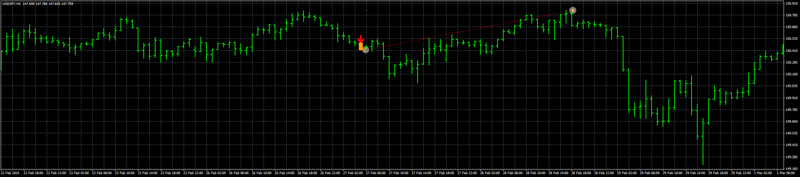

# Marubozu_EA

> Source: https://fxcodebase.com/code/viewtopic.php?f=38&t=74687  
> Forum: 38 · Topic 74687 · 5 post(s)

---

## Marubozu_EA

**Apprentice** · Tue Mar 12, 2024 12:42 pm

Based on the request.
[https://fxcodebase.com/code/viewtopic.php?f=17&t=74483](https://fxcodebase.com/code/viewtopic.php?f=17&t=74483)

 [Marubozu.mq4](files/154664/Marubozu.mq4)

 [Marubozu_EA_v1.00.mq4](files/154664/Marubozu_EA_v1.00.mq4)

 [Marubozu.mq5](files/154664/Marubozu.mq5)

 [Marubozu_EA_v1.00.mq5](files/154664/Marubozu_EA_v1.00.mq5)

---

## Re: Marubozu_EA

**ZeroMenthol** · Sun Mar 24, 2024 12:01 am

hi! can you add a Trade Reverse Signal option? thank you!

---

## Re: Marubozu_EA

**ZeroMenthol** · Sun Mar 24, 2024 9:06 pm

hi!

I have tested the EA, it seems that SL is always giving me a value of the spread only regardless of what you enter only the SL VALUE Settings.

example:
IF I put SL value of: 30 pips

the SL will give me only a value of 6 pips

6 pips being the current spread .

---

## Re: Marubozu_EA

**Apprentice** · Wed Mar 27, 2024 10:12 am

We have added your request to the development list.
Development reference 267

---

## Re: Marubozu_EA

**Apprentice** · Fri May 10, 2024 6:16 am

[Marubozu_EA_v1.10.mq5](files/155278/Marubozu_EA_v1.10.mq5)

 [Marubozu_EA_v1.10.mq4](files/155278/Marubozu_EA_v1.10.mq4)
