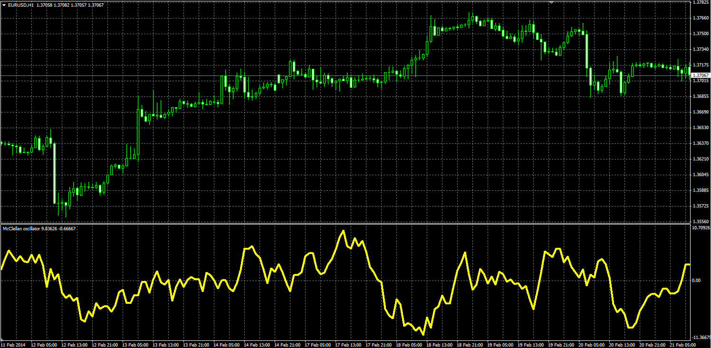
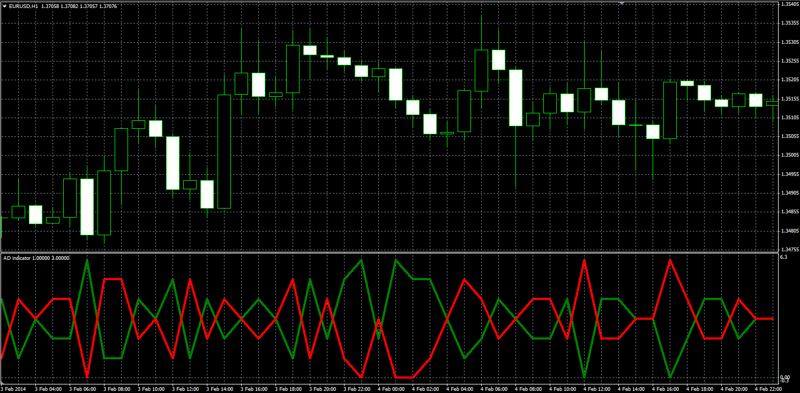
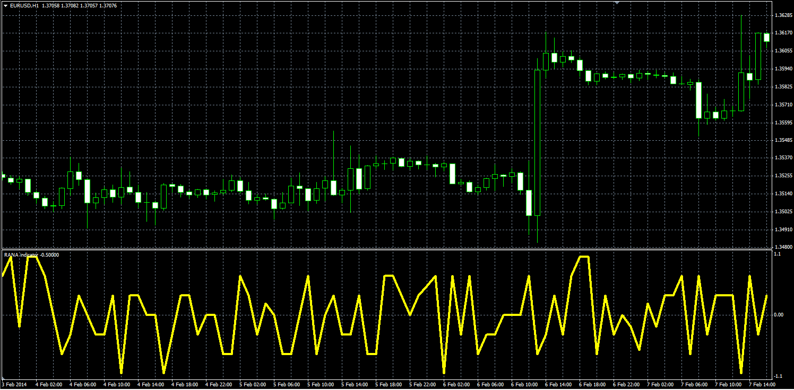
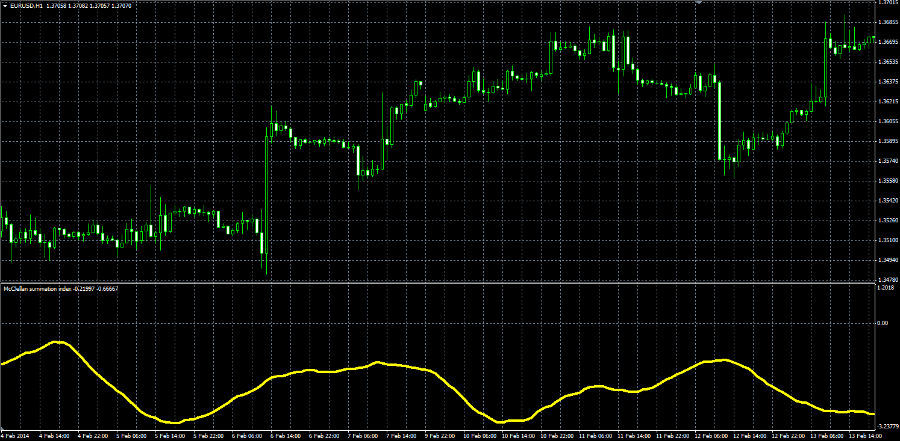
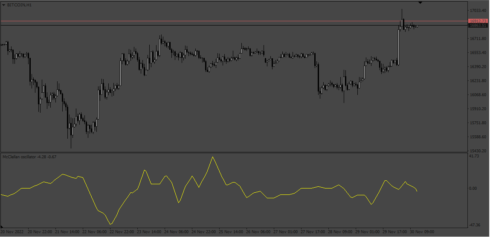

# McClellan Oscillator

> Source: https://fxcodebase.com/code/viewtopic.php?f=38&t=60493  
> Forum: 38 · Topic 60493 · 2 post(s)

---

## McClellan Oscillator

**Alexander.Gettinger** · Thu Apr 03, 2014 12:35 pm

Original LUA indicators: [viewtopic.php?f=17&t=24282&p=41805](https://fxcodebase.com/code/viewtopic.php?f=17&t=24282&p=41805).

 

Download:

 [McClellan_Oscillator.mq4](files/93359/McClellan_Oscillator.mq4)

**AD indicator:**

 

Download:

 [AD_Indicator.mq4](files/93359/AD_Indicator.mq4)

**RANA:**

 

Download:

 [RANA.mq4](files/93359/RANA.mq4)

**McClellan summation index:**

 

Download:

 [McClellan_Summation_Index.mq4](files/93359/McClellan_Summation_Index.mq4)

---

## Re: McClellan Oscillator

**Apprentice** · Wed Nov 30, 2022 1:23 pm

 [mcclellan_oscillator.mq4](files/148496/mcclellan_oscillator.mq4)
