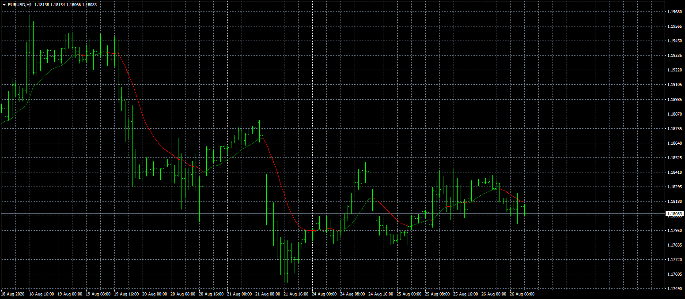

# mcginley-dynamic-indicator

> Source: https://fxcodebase.com/code/viewtopic.php?f=38&t=70331  
> Forum: 38 · Topic 70331 · 4 post(s)

---

## mcginley-dynamic-indicator

**Apprentice** · Wed Aug 26, 2020 6:04 am

Based on request.
[viewtopic.php?f=27&t=70244](https://fxcodebase.com/code/viewtopic.php?f=27&t=70244)

 [mcginley-dynamic-indicator.mq4](files/137083/mcginley-dynamic-indicator.mq4)

TS2 version.
[https://fxcodebase.com/code/viewtopic.php?f=17&t=73593](https://fxcodebase.com/code/viewtopic.php?f=17&t=73593)

---

## Re: mcginley-dynamic-indicator

**xristos1982** · Tue Apr 11, 2023 1:56 pm

Can i have this in lua.please?

---

## Re: mcginley-dynamic-indicator

**Apprentice** · Wed Apr 12, 2023 3:19 am

We have added your request to the development list.
Development reference 311.

---

## Re: mcginley-dynamic-indicator

**Apprentice** · Wed Apr 12, 2023 11:43 am

TS2 version.
[https://fxcodebase.com/code/viewtopic.php?f=17&t=73593](https://fxcodebase.com/code/viewtopic.php?f=17&t=73593)
