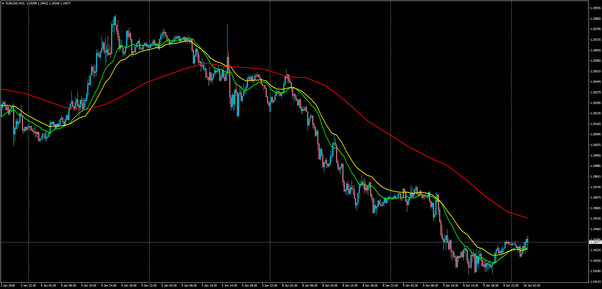

# McGinley Dynamic MTF

> Source: https://fxcodebase.com/code/viewtopic.php?f=38&t=65619  
> Forum: 38 · Topic 65619 · 3 post(s)

---

## McGinley Dynamic MTF

**Apprentice** · Wed Jan 10, 2018 10:27 am

LUA Original: [viewtopic.php?f=17&t=2950](https://fxcodebase.com/code/viewtopic.php?f=17&t=2950)

Description:

This is the MT4 version of the LUA original, with an addition: It presents 3 TF's at the same time taking the analysis a step further.

In brief: The McGinley Dynamic (MD) technical indicator was designed by John R. McGinley.

McGinley considered that moving averages should not be used as trading systems or signal generators, but instead, they should be used as smoothing mechanisms.

MD tracks price better than any moving average.

McGinley Dynamic Formula ( The formula differs from the standard).
Yesterday's EMA + (Today's close - Yesterday's EMA) / (Today's close / Yesterday's EMA * 125)

 [McGinley_Dynamic_MTF.mq4](files/116950/McGinley_Dynamic_MTF.mq4)

---

## Re: McGinley Dynamic MTF

**bartwas1** · Wed Jan 10, 2018 9:06 pm

Hi Apprentice

Would you mind to write this version in lua? It seems to be more useful when utilises 3 TFs rather than one. It shows price relation between time frames.

Thank you,
Bart.

---

## Re: McGinley Dynamic MTF

**Apprentice** · Thu Jan 11, 2018 6:48 am

Try Multi Time Frame McGinley Dynamic.lua
[viewtopic.php?f=17&t=2950&p=116974#p116974](https://fxcodebase.com/code/viewtopic.php?f=17&t=2950&p=116974#p116974)
