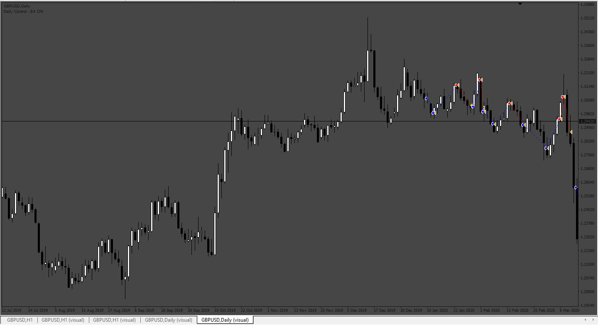
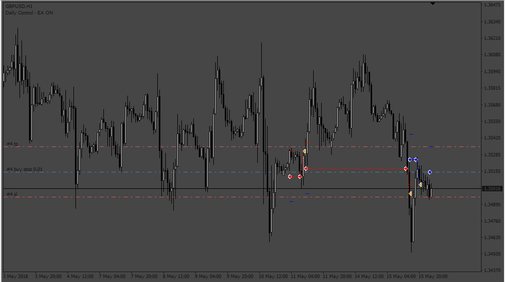

# Mean Reversion Trading EA

> Source: https://fxcodebase.com/code/viewtopic.php?f=38&t=71894  
> Forum: 38 · Topic 71894 · 4 post(s)

---

## Mean Reversion Trading EA

**Apprentice** · Fri Feb 18, 2022 5:45 am

Based on the request.
[https://fxcodebase.com/code/viewtopic.php?f=27&p=144987](https://fxcodebase.com/code/viewtopic.php?f=27&p=144987)

 [Mean Reversion Trading EA.mq4](files/145076/Mean%20Reversion%20Trading%20EA.mq4)

---

## Re: Mean Reversion Trading EA

**PhenomDC** · Thu Oct 27, 2022 8:23 am

Hello Apprentice, this is one of your best works yet but there's a challenge. I would like for it to work with pending orders instead of instead of instant execution once a trade signal if formed. In a buy signal, pending buy stop order should be place at the open price of the previous bar. Vice versa for sell signals.

---

## Re: Mean Reversion Trading EA

**Apprentice** · Sun Oct 30, 2022 4:25 am

We have added your request to the development list.
Development reference 693.

---

## Re: Mean Reversion Trading EA

**Apprentice** · Fri Nov 04, 2022 2:46 am

 [Mean_Reversion_Trading_EA.mq4](files/148138/Mean_Reversion_Trading_EA.mq4)
