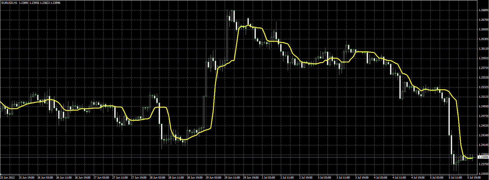

# Median moving average

> Source: https://fxcodebase.com/code/viewtopic.php?f=38&t=20876  
> Forum: 38 · Topic 20876 · 1 post(s)

---

## Median moving average

**Alexander.Gettinger** · Thu Jul 05, 2012 5:03 pm

For calculation of Median MA set of the prices (Price[i], Price[i-1], …, Price[i-N]) is sorted (on increase or decrease) and take value with index ((N-1)/2) from the set (for odd N) or (Value[N/2]+Value[N/2+1])/2 (for even N).

 

Download:

 [MedianMA.mq4](files/36565/MedianMA.mq4)
