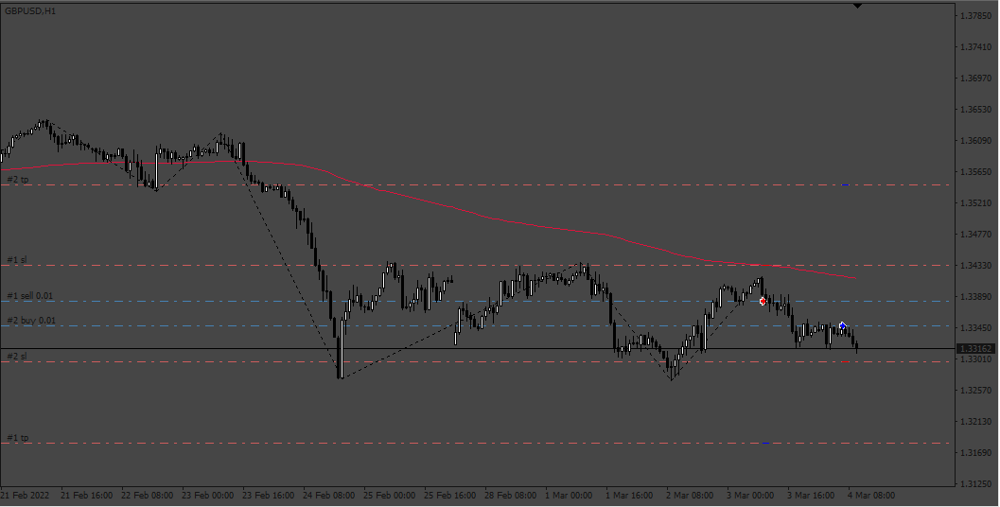
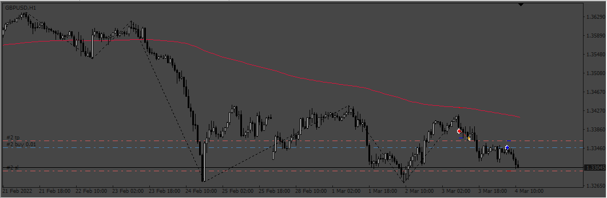

# Medium_term_Trading_EA

> Source: https://fxcodebase.com/code/viewtopic.php?f=38&t=74700  
> Forum: 38 · Topic 74700 · 4 post(s)

---

## Medium_term_Trading_EA

**Apprentice** · Sat Mar 16, 2024 2:16 pm

 

Based on the request.
[https://fxcodebase.com/code/viewtopic.php?f=27&p=154003](https://fxcodebase.com/code/viewtopic.php?f=27&p=154003)
about Position CAP and Live mode, being sure that have "close oposite"=false

 [Elliot oscillator - waves.mq4](files/154709/Elliot%20oscillator%20-%20waves.mq4)

 [RSI_MA.mq4](files/154709/RSI_MA.mq4)

 [Medium_term_Trading_EA.mq4](files/154709/Medium_term_Trading_EA.mq4)

---

## Re: Medium_term_Trading_EA

**crypto0014** · Sun Mar 17, 2024 8:48 pm

RSI_MA indicator unable to compile

---

## Re: Medium_term_Trading_EA

**Apprentice** · Wed Mar 20, 2024 3:12 pm

We have added your request to the development list.
Development reference 250

---

## Re: Medium_term_Trading_EA

**Apprentice** · Mon Mar 25, 2024 6:11 pm

[40379](files/154828/250.png)

 [RSI_MA.mq4](files/154828/RSI_MA.mq4)
