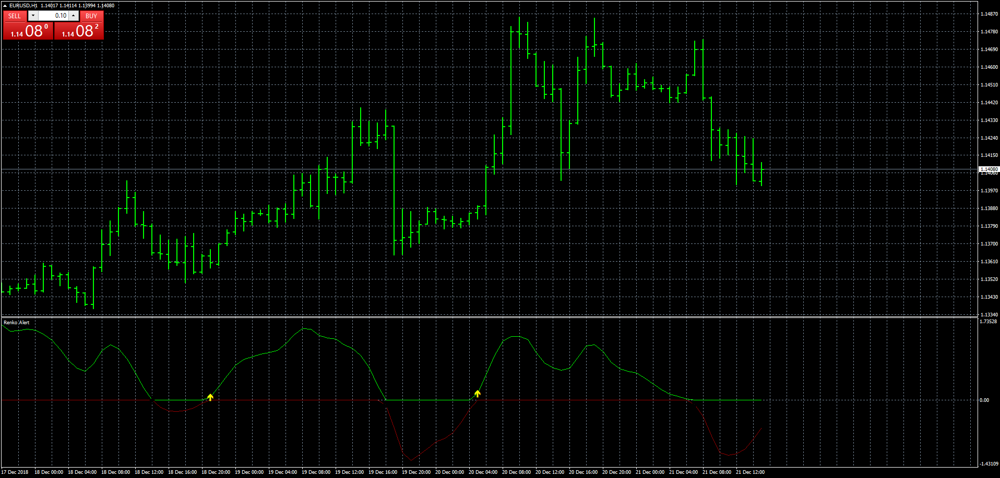
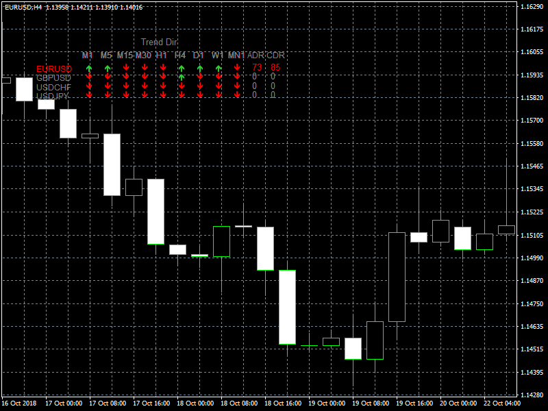
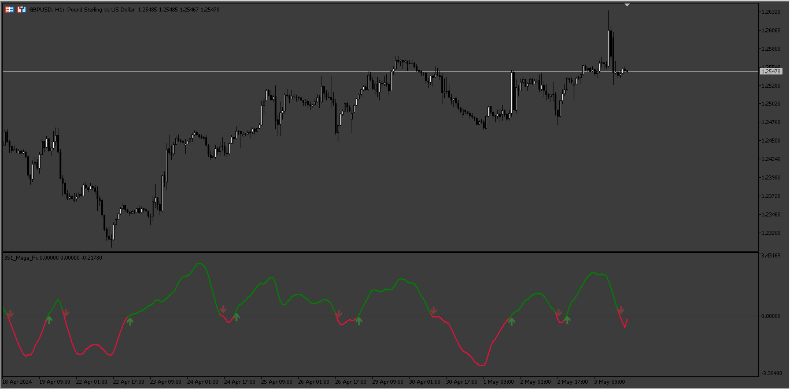

# MEGA_FX

> Source: https://fxcodebase.com/code/viewtopic.php?f=38&t=67187  
> Forum: 38 · Topic 67187 · 17 post(s)

---

## MEGA_FX

**Apprentice** · Fri Dec 21, 2018 12:16 pm

 [MEGA_FX.mq4](files/122988/MEGA_FX.mq4)

 

 [MTF MEGA_FX.mq4](files/122988/MTF%20MEGA_FX.mq4)

 [MEGA_FX EA.mq4](files/122988/MEGA_FX%20EA.mq4)

---

## Re: MEGA_FX

**TheGMan** · Sun Apr 21, 2019 5:24 pm

Hi Apprentice

This seems to be a decent indicator that paints some pretty good signals.

I would like to know a bit more about it. What is the reason for the signals to paint? The indi name on the chart says Renko, is it basing the signals on some sort of Renko brick change of direction? If yes what size Renkos?

Does it repaint?

Thank you!

---

## Re: MEGA_FX

**Apprentice** · Fri Apr 26, 2019 6:02 am

MTF MEGA_FX added.

---

## Re: MEGA_FX

**TheGMan** · Fri Apr 26, 2019 7:14 am

This is Fantastic Apprentice!

However, there is just one problem... all the arrows on all pairs & time frames point in the opposite direction of what the original Mega_FX indicator shows. You can see in the example screenshot pointing out the M30 on U/J

I'm sure it is just a simple mistake in the code that can be corrected.

G

---

## Re: MEGA_FX

**Apprentice** · Wed May 01, 2019 5:53 am

Try it now.

---

## Re: MEGA_FX

**TheGMan** · Wed May 01, 2019 8:46 am

> **Apprentice wrote:**
> Try it now.

This is now Perfect!

Thank you, Apprentice!

---

## Re: MEGA_FX

**NothingPersona1** · Sun Jun 28, 2020 2:58 pm

> **TheGMan wrote:**
> Does it repaint?

Yes

---

## Re: MEGA_FX

**neozbr** · Mon Oct 24, 2022 2:49 pm

can you please add a martingale options, please,thanks.

---

## Re: MEGA_FX

**Apprentice** · Wed Oct 26, 2022 12:15 pm

We have added your request to the development list.
Development reference 682.

---

## Re: MEGA_FX

**PhenomDC** · Thu Oct 27, 2022 7:52 am

Hello Apprentice, just tested this EA. It needs an active trailing stop ("TSL ON" kind)

---

## Re: MEGA_FX

**Apprentice** · Tue Nov 08, 2022 6:31 am

[MEGA_FX_EA.mq4](files/148211/MEGA_FX_EA.mq4)

Martingale options added.

---

## Re: MEGA_FX

**nadal5739** · Mon Apr 29, 2024 8:02 am

HI DEAR ADMIN
is it possible for you to make a mt5 version as well please?
it would be very much appreciated
i mean the indicator not the ea

---

## Re: MEGA_FX

**Apprentice** · Mon Apr 29, 2024 2:32 pm

We have added your request to the development list.
Development reference 351

---

## Re: MEGA_FX

**rickCreations** · Mon Apr 29, 2024 11:50 pm

Trailing stop isn't working

---

## Re: MEGA_FX

**nadal5739** · Thu May 02, 2024 7:04 am

and also can you make it completely non repainting in mt5?

---

## Re: MEGA_FX

**Apprentice** · Tue May 07, 2024 3:34 am

 [Mega_Fx.mq5](files/155257/Mega_Fx.mq5)

---

## Re: MEGA_FX

**nadal5739** · Tue May 07, 2024 4:52 am

thanks brother great job
