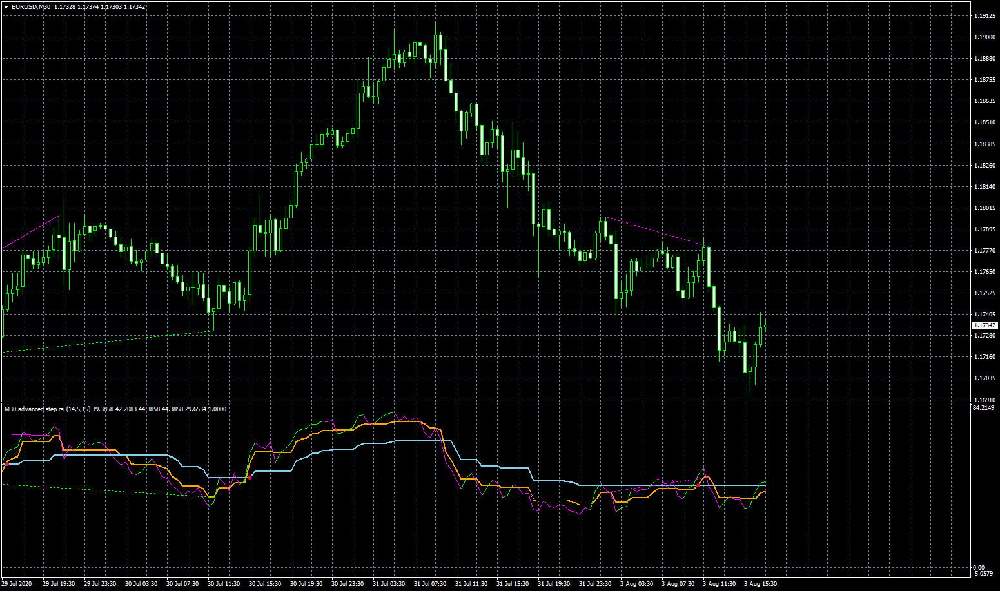

# Metro-Advanced

> Source: https://fxcodebase.com/code/viewtopic.php?f=38&t=70258  
> Forum: 38 · Topic 70258 · 11 post(s)

---

## Metro-Advanced

**Apprentice** · Mon Aug 03, 2020 11:23 am

 [Metro-Advanced.mq4](files/136550/Metro-Advanced.mq4)

---

## Re: Metro-Advanced

**xmohammad** · Mon Aug 03, 2020 2:17 pm

Thanks for The Assist

---

## Re: Metro-Advanced

**bartwas1** · Tue Aug 04, 2020 3:24 am

Hi Apprentice

Is there a marketscope version of this indicator? I've looked under 'metro-advanced' name and couldn't find it. Any chance to point me in the right direction, please?

B.

---

## Re: Metro-Advanced

**Apprentice** · Tue Aug 04, 2020 4:33 am

It is written based on request.
[viewtopic.php?f=27&t=70214](https://fxcodebase.com/code/viewtopic.php?f=27&t=70214)
in MQL4 for MT4 / Meta Trader.

---

## Re: Metro-Advanced

**decoex09** · Tue Mar 09, 2021 8:56 pm

ola esse indicador nao esta funcionando o modo mtf poderia arrumar por favor

---

## Re: Metro-Advanced

**Apprentice** · Wed Mar 10, 2021 2:58 am

Your request is added to the development list.
Development reference 264.

---

## Re: Metro-Advanced

**Apprentice** · Fri Mar 12, 2021 4:19 am

[Metro-Advanced.mq4](files/141157/Metro-Advanced.mq4)

Try this version.

---

## Re: Metro-Advanced

**myer16** · Mon Apr 19, 2021 4:29 am

Can u please post MT5 version of the indicator

---

## Re: Metro-Advanced

**Apprentice** · Tue Apr 20, 2021 3:47 pm

Your request is added to the development list.
Development reference 385.

---

## Re: Metro-Advanced

**xristos1982** · Wed Oct 16, 2024 2:14 pm

Hello,can i have this indicator in lua?Thank you

---

## Re: Metro-Advanced

**Apprentice** · Thu Oct 17, 2024 4:56 pm

We have added your request to the development list.
Development reference 782
